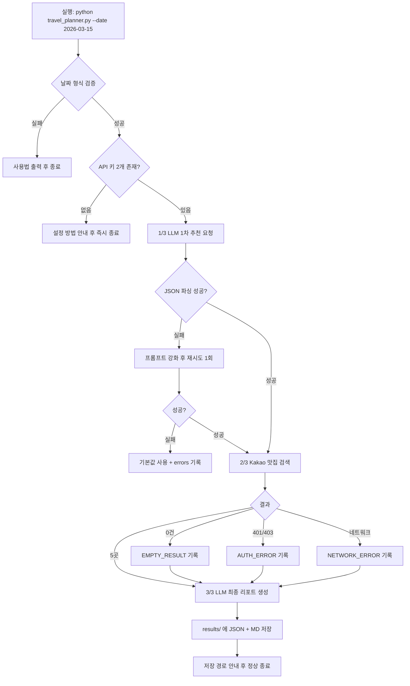

# 📘 [A1-2] Python 응용 
: API 활용 국내 여행지 추천 프로그램 개발

### 과제 수행 보고서 — `jina-gayo`

| 항목 | 내용 |
|---|---|
| **과제명** | Python 응용: API 활용 국내 여행지 추천 프로그램 개발 (A1-2) |
| **분야 / 구분** | AI 활용 학습 / AI 활용 |
| **학습시간** | 40시간 |
| **프로젝트명** | jina-gayo |
| **저장소 URL** | https://github.com/kwork0828/jina-gayo |
| **작성자** | kwork0828 |
| **제출일** | TODO (YYYY-MM-DD) |
| **개발 환경** | GitHub Codespaces (Ubuntu Linux / bash) + VS Code for Web |
| **Python 버전** | TODO (`python --version` 결과) |
| **LLM API** | Google Gemini |
| **지도/장소 API** | Kakao Local — 키워드 장소 검색 |
| **총 커밋 수** | TODO (`git rev-list --count HEAD`) |
| **브랜치** | TODO (`git branch -a`) |
| **메인 실행 파일** | `travel_planner.py` |

> **프로젝트명 `jina-gayo` 의 뜻**
> "지나, 가요?" — 여행 날짜를 던지면 어디로 갈지 답해주는 프로그램이라는 의미로 지었다.
> 와이프 이름이 jina 라서, 이 PJT를 할수있게 도와준 와이프에게 헌정한다는 아부성 의미도 넣었음
> 인생이 이제 400~500개월 남았다. 모든게 지나가니까 소중하면서 의미있게 보내자는 의미. 
---

## 목차

1. [용어 정리](#1-용어-정리)
2. [환경 구축 과정](#2-환경-구축-과정)
3. [프로그램 구조](#3-프로그램-구조)
4. [데이터 구조 설계](#4-데이터-구조-설계)
5. [기능별 실행 화면](#5-기능별-실행-화면)
6. [API 키 보안 조치](#6-api-키-보안-조치)
7. [버전 관리 과정](#7-버전-관리-과정)
8. [시행착오와 해결](#8-시행착오와-해결)
9. [요건 충족 체크리스트](#9-요건-충족-체크리스트)
10. [배운 점 / 개선 방향](#10-배운-점--개선-방향)
11. [부록](#11-부록)

---

## 1. 용어 정리

> 발표 시 질문에 답하기 위해, 이번 과제에서 실제로 사용한 용어만 정리했다.

### 1-1. 프로그램 용어

| 용어 (읽는 법) | 뜻 | 이 과제에서의 쓰임 |
|---|---|---|
| **API** (에이피아이) | Application Programming Interface. 프로그램끼리 정해진 형식으로 대화하는 창구 | Gemini·Kakao 두 창구를 호출 |
| **REST API** (레스트) | HTTP 주소와 메서드로 자원을 다루는 API 설계 방식 | 두 API 모두 REST 방식 |
| **HTTP GET** (겟) | "이 정보 주세요" — 요청 내용을 **주소 뒤에** 붙임 | Kakao 맛집 검색 (`?query=제주 맛집`) |
| **HTTP POST** (포스트) | "이 데이터 처리해 주세요" — 내용을 **본문에** 담음 | Gemini에 프롬프트 전송 |
| **엔드포인트** | API를 호출하는 구체적 주소 한 개 | `https://dapi.kakao.com/v2/local/search/keyword.json` |
| **헤더** (header) | 요청에 붙이는 부가 정보표. 신분증을 여기 넣음 | `Authorization: KakaoAK {키}` |
| **상태 코드** | 서버가 알려주는 처리 결과 번호 | 200 성공 / 401·403 인증실패 / 429 쿼터초과 |
| **JSON** (제이슨) | 이름표와 값의 짝으로 데이터를 적는 표준 형식 | API 응답 및 원본 데이터 저장 |
| **파싱** (parsing) | 텍스트를 프로그램이 쓸 자료형으로 해석하는 일 | `json.loads()` 로 문자열 → dict |
| **스키마** (schema) | 데이터의 뼈대 규칙 | 1차 추천 JSON의 4개 필수 키 |
| **CLI** (씨엘아이) | 터미널에 명령을 쳐서 쓰는 방식 | 웹 화면 없이 터미널로만 실행 |
| **argparse** (아그파스) | 터미널 옵션을 해석해 주는 파이썬 표준 라이브러리 | `--date` 옵션 처리 |
| **환경변수** | 코드 밖 운영체제 쪽에 저장하는 설정값 | API 키 보관 |
| **.env** (닷 이엔브이) | 환경변수를 적어두는 파일. Git에 올리지 않음 | 키 2개 보관 |
| **예외 처리** (try-except) | 오류가 나도 프로그램이 죽지 않게 대비하는 문법 | 모든 API 호출부 |
| **딕셔너리** (dict) | 이름표를 붙여 값을 담는 상자 | 1차 추천 결과 |
| **리스트** (list) | 순서대로 줄 세워 담는 상자 | 맛집 목록, 오류 목록 |
| **f-string** | 문자열 안에 변수를 끼워 넣는 문법 | 프롬프트·리포트 조립 |
| **쿼터** (quota) | 일정 시간당 허용된 호출 횟수 한도 | 429 오류의 원인 |

### 1-2. 도구 용어

| 용어 | 뜻 | 이 과제에서의 쓰임 |
|---|---|---|
| **Git** (깃) | 파일 변경 이력을 저장·되돌리는 프로그램 | 이력 관리 |
| **GitHub** (깃허브) | Git 저장소를 인터넷에 올려 공유하는 서비스 | 과제 제출처 |
| **GitHub Codespaces** | 브라우저 안에서 돌아가는 클라우드 개발 컴퓨터 | 이번 과제의 개발 환경 전체 |
| **Codespaces Secrets** | GitHub 계정에 키를 안전하게 보관해 자동 주입하는 기능 | API 키 영구 보관 |
| **저장소** (Repository) | 프로젝트 파일 + 변경 이력이 담긴 폴더 | `jina-gayo` |
| **커밋** (commit) | 변경 사항을 이력에 기록. 게임의 세이브 포인트 | 기능 단위로 기록 |
| **브랜치** (branch) | 본 줄기를 안 건드리고 실험하는 가지 | `feature/bonus-cache` |
| **머지** (merge) | 가지의 작업을 본 줄기에 합침 | 보너스 기능 병합 |
| **.gitignore** | "이 파일은 Git에 올리지 마" 목록표 | `.env` 차단 |
| **bash** (배시) | 리눅스의 기본 터미널 | Codespaces 터미널 |
| **pip** (핍) | 파이썬 라이브러리 설치 도구 | `requests` 등 설치 |
| **requirements.txt** | 필요한 라이브러리 목록 파일 | 재현성 확보 |

---

## 2. 환경 구축 과정

### 2-1. 왜 GitHub Codespaces를 선택했는가

| 이유 | 설명 |
|---|---|
| 설치 부담 없음 | Python·Git이 이미 설치된 상태로 시작한다 |
| 어느 PC에서도 동일 | 브라우저만 있으면 같은 환경이 열린다 |
| 환경 격리 | 컨테이너가 프로젝트 전용이라 별도 가상환경 없이도 다른 프로젝트와 충돌하지 않는다 |
| Secrets 연동 | GitHub 계정에 저장한 키가 환경변수로 자동 주입되어, 키 파일을 들고 다니지 않아도 된다 |

> ⚠️ **주의한 점:** Codespaces는 리눅스라 Windows 명령(`dir`, `$env:`)이 통하지 않는다.
> 모든 명령을 bash 문법(`ls`, `export`)으로 작성했다.

### 2-2. 최종 환경 정보

| 구분 | 값 | 확인 명령 |
|---|---|---|
| 개발 환경 | GitHub Codespaces | — |
| OS | Ubuntu Linux | `cat /etc/os-release` |
| 셸 | bash | `echo $SHELL` |
| Python | TODO (3.10 이상 요건 충족) | `python --version` |
| pip | TODO | `pip --version` |
| Git | TODO | `git --version` |

| 저장소 URL : https://github.com/kwork0828/jina-gayo |
| 공개 설정   : Public |


### 2-3. 구축 절차

| 순서 | 작업 | 캡처 |
|---|---|---|
| 1 | GitHub 저장소 생성 (`.gitignore: Python` 포함) | `images/01-github-repo-created.png` |
| 2 | Codespace 실행 | `images/02-codespace-launch.png` |
| 3 | Python 버전 확인 | `images/03-python-version.png` |
| 4 | 폴더 구조 생성 (`images/`, `results/`) | `images/04-folder-structure.png` |
| 5 | 라이브러리 설치 | `images/05-pip-install.png` |
| 6 | Kakao REST API 키 발급 | `images/06-kakao-key.png` |
| 7 | Gemini API 키 발급 | `images/07-gemini-key.png` |
| 8 | Codespaces Secrets 등록 | `images/08-codespaces-secrets.png` |
| 9 | 키 로드 검증 | `images/09-env-check.png` |

#### ▸ 1. 저장소 생성

> 생성 시 `.gitignore` 템플릿을 **Python**으로 지정했다.
> 첫 커밋부터 `.env` 가 차단되도록 하기 위해서다. **보안은 나중에 붙이는 것이 아니라 시작 전에 세팅해야 한다.**

#### ▸ 2. Codespace 실행


#### ▸ 3. Python 버전 확인

```bash
python --version
```
> TODO 확인. 과제 요건인 **3.10 이상**을 충족한다.

#### ▸ 4. 폴더 구조 생성


#### ▸ 5. 라이브러리 설치

```bash
pip install -r requirements.txt
```

#### ▸ 6~7. API 키 발급


> ⚠️ 두 캡처 모두 **키 문자열을 검은 사각형으로 가린 뒤** 저장했다.

#### ▸ 8. Codespaces Secrets 등록

> 키를 GitHub 계정에 저장해 두면, Codespace가 새로 만들어져도 환경변수로 자동 주입된다.
> **파일에 키를 들고 다니지 않아도 된다는 점**이 가장 큰 장점이다.

#### ▸ 9. 키 로드 검증

> 키 **값**은 출력하지 않고, 앞 4자리와 길이만 표시해 로드 여부만 확인했다.

### 2-4. 최종 폴더 구조

```
jina-gayo/
├── .env                      # API 키 (Git 추적 제외)
├── .env.example              # 키 없는 견본 — 이것만 커밋
├── .gitignore
├── README.md                 # 방문자용 안내
├── report.md                 # 평가자용 보고서 (이 문서)
├── requirements.txt
├── travel_planner.py         # 메인 프로그램
├── images/                   # 보고서용 캡처
│   ├── 01-github-repo-created.png
│   └── ...
└── results/                  # 실행 결과 (자동 생성)
    ├── TODO_raw.json
    └── TODO_travel_plan.md
```

### 2-5. requirements.txt

```txt
requests
python-dotenv
google-generativeai
```

| 라이브러리 | 역할 |
|---|---|
| `requests` | HTTP 요청 도구. Kakao Local 호출 |
| `python-dotenv` | `.env` 파일을 읽어 환경변수로 올림 |
| `google-generativeai` | Gemini 공식 SDK |

---

## 3. 프로그램 구조

### 3-1. 전체 흐름도



<details>
<summary>📐 텍스트 버전 흐름도 (Mermaid가 안 보일 때)</summary>

```
[CLI 입력]
    │
    ├─ 날짜 형식 틀림 ──────────────► 사용법 출력 후 종료
    ├─ API 키 없음 ────────────────► 설정 안내 후 즉시 종료
    ▼
[1/3] LLM 1차 추천 ──── 파싱 실패 ──► 재시도 1회 ──► 실패 시 기본값 + errors
    ▼
[2/3] Kakao 맛집 검색 ─┬─ 0건 ─────► errors 기록, 계속 진행
                        ├─ 401 ─────► errors 기록, 계속 진행
                        └─ 성공 5곳
    ▼
[3/3] LLM 최종 리포트 생성 (Markdown)
    ▼
[저장] results/{date}_raw.json  +  results/{date}_travel_plan.md
    ▼
[종료] 저장 경로 안내
```
</details>

> **설계 원칙 한 줄:** 중간 어느 단계가 실패해도 **리포트는 반드시 생성된다.**
> 실패는 지우지 않고 `errors` 배열에 남겨 리포트에 함께 출력한다.

### 3-2. 함수 표

| # | 함수명 | 입력 | 출력 | 역할 | 관련 요건 |
|---|---|---|---|---|---|
| 1 | `parse_args()` | 터미널 인자 | `Namespace` | argparse로 `--date` 수집 | CLI 인터페이스 |
| 2 | `validate_date(s)` | `str` | `bool` | `YYYY-MM-DD` 형식·실존 날짜 검증 | 입력값 검증 |
| 3 | `load_api_keys()` | 없음 | `(str, str)` | 환경변수/`.env`에서 키 로드, 없으면 안내 후 종료 | 보안·키 미설정 정책 |
| 4 | `get_recommendation(date, key, errors)` | `str` | `dict` | Gemini 1차 추천 + JSON 파싱 + 재시도 1회 | LLM 연동 |
| 5 | `search_restaurants(city, key, errors)` | `str` | `list[dict]` | Kakao 맛집 5곳 검색, 실패 시 빈 리스트 | 지도 API 연동 |
| 6 | `generate_report(rec, places, date, errors)` | `dict`,`list` | `str` | 최종 Markdown 리포트 생성 | 리포트 생성 |
| 7 | `save_results(date, payload, md)` | — | `(Path, Path)` | `results/` 생성 후 JSON·MD 저장 | 결과 저장 |
| 8 | `main()` | 없음 | 없음 | 전체 흐름 조립 + 진행 로그 출력 | 전체 |

### 3-3. 실행 시퀀스 (실제 출력 로그)

```text
TODO: 실제 실행 로그를 그대로 붙여넣기
```

---

## 4. 데이터 구조 설계

> 이 과제의 본질은 **"A라는 API의 출력을 B라는 API의 입력으로 바꾸는 것"** 이다.
> 그래서 자료형 선택이 곧 프로그램 설계였다.

### 4-1. 왜 자료형 설계가 먼저인가 — 비유

택배 물류센터를 떠올려 보자.

- **딕셔너리(dict)** = **이름표가 붙은 서랍장.** "도시", "날씨", "행사" 칸이 정해져 있어 `rec["recommended_city"]` 처럼 **이름으로 즉시** 꺼낸다. 순서는 상관없다.
- **리스트(list)** = **줄 세운 컨베이어 벨트.** 몇 개가 올지 모르고 순서가 의미를 가진다. 맛집이 5곳일 수도 0곳일 수도 있으니 벨트가 맞다.
- **리스트 안의 딕셔너리(list[dict])** = **벨트 위에 줄줄이 놓인 서랍장.** 맛집 하나하나가 이름·주소·카테고리 칸을 가진 서랍장이고, 그게 여러 개 흐른다.

즉 **"칸 이름이 고정 = dict / 개수가 유동 = list"** 라는 한 문장이 설계 기준이었다.

### 4-2. 자료형 선택 근거

| 데이터 | 선택 | 왜 이 자료형인가 | 다른 걸 썼다면 |
|---|---|---|---|
| 1차 추천 결과 | `dict` | 키 4개가 스키마로 **고정**. 이름으로 접근해야 다음 단계로 넘기기 쉽다 | `list`면 `rec[0]`처럼 **순서 의존** → 응답 순서가 바뀌면 조용히 깨진다 |
| 행사/축제 | `list[str]` | 개수가 1~3개로 유동, 순서 유지, 반복문 출력 | 콤마로 이은 `str`이면 개수 셀 때마다 다시 쪼개야 한다 |
| 맛집 목록 | `list[dict]` | 개수 유동(0~5) + 항목마다 고정 필드 | `dict`(가게명이 키)면 **동명 가게가 덮어써진다** |
| 오류 기록 | `list[dict]` | 발생 **순서**가 진단에 중요, 0건 가능 | `str` 누적이면 프로그램이 다시 읽어 처리할 수 없다 |
| 최종 리포트 | `str` (Markdown) | 사람이 읽는 최종 산출물, 파일로 바로 저장 | 구조화 자료형은 사람이 읽기 불편 |

### 4-3. 1차 추천 JSON 스키마

```json
{
  "recommended_city": "제주",
  "weather": "3월 중순 평균 15°C 내외, 바람이 있으나 비교적 온화함",
  "events": ["유채꽃 축제", "봄 시즌 지역 축제"],
  "reason": "3월 중순은 제주가 봄꽃을 즐기기 좋은 시기입니다. 항공·숙박도 성수기 대비 부담이 적고, 야외 활동에 무리가 적습니다."
}
```

| 키 | 타입 | 필수 | 왜 이 타입인가 |
|---|---|---|---|
| `recommended_city` | `string` | ✅ | **이 값 하나가 2단계 Kakao 검색어가 된다.** 리스트면 검색어로 못 쓴다 |
| `weather` | `string` | ✅ | 사람이 읽는 요약 한 문장. 수치 분석이 목적이 아니다 |
| `events` | `array of string` | ✅ | 0~3개 유동. 리포트에서 불릿으로 반복 출력 |
| `reason` | `string` | ✅ | 2~4문장 서술형 |

> **가장 중요한 연결점:** `recommended_city` 값이 `f"{city} 맛집"` 으로 조립되어
> **Kakao API의 `query` 파라미터**로 들어간다. 이것이 요건에서 말하는
> "LLM 출력의 구조화 → 다음 단계 입력으로 활용"의 실체다.

### 4-4. 맛집 아이템 스키마

```json
{
  "name": "TODO 가게명",
  "address": "TODO 도로명 주소",
  "category": "음식점 > 한식",
  "url": "http://place.map.kakao.com/TODO",
  "x": 126.5311884,
  "y": 33.4996213
}
```

| 키 | 타입 | Kakao 원본 필드 | 비고 |
|---|---|---|---|
| `name` | string | `place_name` | 우리 스키마 이름으로 변환 |
| `address` | string | `road_address_name` (없으면 `address_name`) | 도로명 우선, 없으면 지번 |
| `category` | string | `category_name` | |
| `url` | string | `place_url` | |
| `x`, `y` | number | `x`(경도), `y`(위도) | Kakao는 **문자열**로 주므로 `float()` 변환 |

> ⚠️ Kakao의 `x`는 경도(longitude), `y`는 위도(latitude)다.
> 흔히 쓰는 `lat, lng` 순서와 **반대**라 헷갈리기 쉽다.

### 4-5. 오류 기록 스키마

```json
{ "step": "place_search", "type": "AUTH_ERROR", "message": "HTTP 401" }
```

| `step` | `type` | 발생 상황 |
|---|---|---|
| `llm_recommend` | `PARSE_ERROR` | 1차 JSON 파싱 실패 |
| `llm_recommend` | `RETRY_FAILED` | 재시도 1회도 실패 |
| `place_search` | `EMPTY_RESULT` | 검색 결과 0건 |
| `place_search` | `AUTH_ERROR` | HTTP 401 / 403 |
| `place_search` | `QUOTA_ERROR` | HTTP 429 |
| `place_search` | `NETWORK_ERROR` | 타임아웃·연결 실패 |
| `llm_report` | `API_ERROR` | 최종 리포트 생성 실패 |

### 4-6. 최종 저장 JSON 전체 구조

```json
{
  "date": "2026-03-15",
  "generated_at": "2026-03-10T14:22:05",
  "recommendation": { "...4-3의 dict..." },
  "restaurants": [ "...4-4의 dict 0~5개..." ],
  "errors": [ "...4-5의 dict 0개 이상..." ]
}
```

> **왜 하나의 파일에 다 담았나:** 요건이 "원본 JSON에 1차 추천 + 맛집 결과 + errors 포함"을
> 요구했다. 파일을 쪼개면 **어느 실행의 결과끼리 짝인지** 추적이 어려워진다.

### 4-7. 이 설계의 장점과 한계

**장점**

| 항목 | 설명 |
|---|---|
| 그대로 저장 가능 | 전부 파이썬 기본 자료형이라 `json.dump()` 한 줄로 파일이 된다 |
| 부분 실패에 강함 | 맛집이 `[]`여도 리포트 생성이 멈추지 않는다 |
| 연결이 명시적 | `rec["recommended_city"]` 한 줄로 API 간 연결점이 코드에 드러난다 |
| 캐싱과 궁합 | 저장된 JSON만 다시 읽으면 API 호출 없이 리포트 재생성이 된다 |

**한계와 개선 방향**

| 한계 | 왜 문제인가 | 개선안 |
|---|---|---|
| 타입 검증이 수동 | LLM이 `events`를 문자열로 주면 `for` 문이 글자 단위로 돈다 | `pydantic` 스키마 검증 도입 |
| 좌표계 정보 없음 | WGS84인지 문서에만 있고 데이터에는 없다 | `"coord_system": "WGS84"` 필드 추가 |
| 단일 도시 전제 | 복수 도시 확장 시 최상위 구조를 바꿔야 한다 | 처음부터 `cities: [...]` 배열로 설계 |
| 중복 제거 없음 | 지점만 다른 동일 브랜드가 5곳을 차지할 수 있다 | `name` 정규화 후 dedup |

---

## 5. 기능별 실행 화면

> 각 기능을 **성공 사례**와 **예외 사례**로 나누어 검증했다.

### 5-1. CLI 사용법 출력

```bash
python travel_planner.py --help
```

```text
TODO
```

### 5-2. ❌ 예외 — 잘못된 날짜 형식

```bash
python travel_planner.py --date "2026/03/15"
```

```text
TODO
```
> `datetime.strptime()` 으로 형식과 **실존 여부**를 동시에 검증한다.
> `2026-02-30` 같은 없는 날짜도 이 방식이면 함께 걸러진다.

### 5-3. ❌ 예외 — API 키 미설정


```text
TODO
```
> 요건의 "키 미설정 시 **즉시 종료** + 설정 방법 안내"에 해당한다.
> 키 없이 호출하면 무의미한 401만 쌓이므로 **출발 전에 막는 것**이 옳다.

### 5-4. ✅ LLM 1차 추천 (JSON 구조화 성공)


```json
TODO
```

### 5-5. ❌ 예외 — JSON 파싱 실패 후 재시도 1회


```text
TODO
```
> LLM이 코드펜스나 "네, 아래와 같습니다" 같은 문장을 함께 반환하는 경우가 있다.
> 1차로 펜스를 제거해 재파싱하고, 그래도 실패하면 **"필수 키만 JSON으로"** 라고
> 프롬프트를 강화해 **딱 1회만** 재요청한다. (무한 재시도 금지 요건 준수)

### 5-6. ✅ 맛집 검색 성공 (5곳)


```text
TODO
```

### 5-7. ❌ 예외 — 검색 결과 0건


```text
TODO
```
> 프로그램이 중단되지 않고 리포트에 `데이터 없음`으로 표기하며 진행한다.

### 5-8. ❌ 예외 — 인증 실패 (401)

> 검증 방법: `.env`의 Kakao 키를 일부러 `INVALID_KEY_FOR_TEST` 로 바꿔 실행


```text
TODO
```

### 5-9. ✅ 전체 실행 완료


```text
TODO
```

### 5-10. ✅ 결과 파일 생성 확인

```bash
ls -l results
```

```text
TODO
```

### 5-11. ✅ 생성된 리포트 미리보기


<details>
<summary>생성된 리포트 전문 보기</summary>

```markdown
TODO: results/*_travel_plan.md 내용 붙여넣기
```
</details>

### 5-12. 🎁 보너스 — 결과 캐싱


```text
TODO
```
> 동일 `--date` 재실행 시 저장된 JSON을 재사용해 API 호출을 건너뛴다.
> **API 비용과 응답 시간을 동시에 절약**하는 가장 기본적인 최적화다.

### 5-13. 🎁 보너스 — 복수 지역 추천


```text
TODO
```

---

## 6. API 키 보안 조치

> 요건에서 보안이 **필수 제약**으로 명시되어 별도 장으로 정리한다.

### 6-1. 왜 키를 코드에 쓰면 안 되는가

| 이유 | 설명 |
|---|---|
| 공유 사고 방지 | 저장소가 Public이면 키가 **전 세계에 공개**된다. 봇이 수 분 내에 수집한다 |
| 교체 용이성 | 유출돼도 `.env` 한 줄만 바꾸면 된다. 코드 수정·재배포 불필요 |
| 과금 사고 예방 | 유출된 키로 타인이 호출하면 **내 계정에 요금이 청구**된다 |
| 환경별 분리 | 개발용·운영용 키를 코드 변경 없이 바꿔 끼울 수 있다 |

### 6-2. 실제 적용한 5중 방어

| # | 조치 | 확인 방법 |
|---|---|---|
| 1 | 저장소 생성 시부터 `.gitignore`에 `.env` 포함 | `git status` 에 `.env` 미표시 |
| 2 | **Codespaces Secrets** 에 키 보관 (계정 단위 암호화 저장) | `images/08-codespaces-secrets.png` |
| 3 | `.env.example` 만 커밋 (키 자리에 `YOUR_KEY_HERE`) | 저장소에서 파일 확인 |
| 4 | 코드는 `os.getenv()` 로만 접근, 리터럴 키 0개 | `grep` 검색 시 0건 |
| 5 | 로그·리포트·캡처에 키 미출력 (앞 4자리 + `***`) | 캡처 육안 확인 |

> **환경변수와 `.env` 두 방식을 모두 구현한 이유:** Codespaces Secrets는 클라우드 환경에서
> 자동 주입되어 편하지만, 다른 사람이 로컬에서 실행할 땐 쓸 수 없다.
> 그래서 `.env` 도 함께 지원해 **어느 환경에서든 동작**하도록 했다.

### 6-3. `.env.example` (저장소에 올라간 파일)

```dotenv
GEMINI_API_KEY=YOUR_GEMINI_KEY_HERE
KAKAO_REST_API_KEY=YOUR_KAKAO_KEY_HERE
```

### 6-4. 키가 추적되지 않음을 증명

```bash
git status --short
```
```text
TODO: .env 가 목록에 없음을 보여주는 실제 출력
```

---

## 7. 버전 관리 과정

### 7-1. 커밋 전략

> **원칙: "기능 하나 = 커밋 하나."**
> 오류가 났을 때 어느 커밋에서 깨졌는지 되짚기 쉽고,
> 커밋 로그 자체가 개발 순서를 보여주는 기록이 되기 때문이다.

### 7-2. 커밋 메시지 규칙

| 접두어 | 뜻 | 예시 |
|---|---|---|
| `feat` | 새 기능 | `feat: add argparse CLI with date validation` |
| `fix` | 버그 수정 | `fix: handle kakao 401 without crashing` |
| `docs` | 문서 | `docs: write README usage section` |
| `chore` | 설정·잡무 | `chore: add requirements.txt` |
| `refactor` | 동작 변화 없는 정리 | `refactor: extract save_results function` |

> ✍️ 커밋 메시지는 **전부 영문**으로 작성했다.
> 터미널 인코딩 설정에 따라 한글이 깨져 기록되는 사고가 잦고,
> 한 번 커밋되면 되돌리기가 번거롭기 때문이다.

### 7-3. 실제 커밋 이력 (원문)

```bash
git --no-pager log --oneline --graph --all
```
```text
TODO: 실제 출력을 그대로 붙여넣기. 절대 추정해서 쓰지 말 것
```


```bash
git rev-list --count HEAD
```
```text
TODO
```

### 7-4. 브랜치 전략

```
main ────●────●────●────●──────────────●──── (제출)
                          \            /
feature/bonus-cache        ●────●────●
                        캐싱 구현   머지
```

| 브랜치 | 목적 | 처리 |
|---|---|---|
| `main` | 항상 동작하는 안정 버전 | 제출 기준 |
| `feature/bonus-cache` | 보너스(캐싱) 실험 | `main`으로 머지 |

> **왜 브랜치를 나눴나:** 보너스는 실패해도 되는 실험이다.
> 본 줄기에서 바로 고치면 필수 기능까지 망가질 위험이 있어,
> **가지를 쳐서 실험하고 성공했을 때만 합쳤다.**


### 7-5. 저장소 최종 모습


---

## 8. 시행착오와 해결

> 실제로 겪은 오류만 기록한다. 각 항목은 **원인 → 해결 → 재발 방지** 순서다.
> **TODO: 겪지 않은 항목은 삭제하고, 실제로 겪은 것만 남길 것.**

### 8-1. 요약

| # | 증상 | 원인 유형 | 해결 |
|---|---|---|---|
| 1 | Windows 명령이 Codespaces에서 안 먹힘 | 환경 차이 | bash 문법으로 전환 |
| 2 | LLM 응답에 코드펜스가 섞여 파싱 실패 | 파싱 | 펜스 제거 후 재파싱 → 재시도 1회 |
| 3 | Kakao `HTTP 401` | 인증 | REST API 키로 교체, 헤더 접두어 확인 |
| 4 | 맛집 검색 0건 | 데이터 없음 | 중단 대신 `EMPTY_RESULT` 기록 후 진행 |
| 5 | 한글 커밋 메시지 깨짐 | 인코딩 | 영문 메시지로 통일 |

### 8-2. 상세

#### ① Windows 명령이 통하지 않음

```text
dir: command not found
```

- **원인:** GitHub Codespaces는 **Ubuntu 리눅스**이고 터미널이 bash다. Windows PowerShell 명령(`dir`, `$env:`, `\` 경로)은 존재하지 않는다.
- **해결:** `dir` → `ls`, `$env:KEY="값"` → `export KEY="값"`, 경로 구분자 `\` → `/` 로 전부 바꿨다.
- **재발 방지:** 명령을 치기 전에 **"지금 내가 있는 곳이 Windows인가 리눅스인가"** 를 먼저 떠올린다. 클라우드 개발 환경을 쓴다는 건 곧 **남의 리눅스 컴퓨터를 빌려 쓰는 것**임을 이해하게 됐다.

#### ② LLM 응답이 순수 JSON이 아니었음

```text
json.decoder.JSONDecodeError: Expecting value: line 1 column 1 (char 0)
```

- **원인:** LLM은 친절하게 설명을 덧붙이는 성질이 있어, 코드펜스와 안내 문장을 함께 반환했다.
- **해결:** ⓐ 프롬프트에 "**JSON 외 어떤 텍스트도 출력하지 말 것**" 명시 → ⓑ 그래도 섞이면 펜스를 제거하고 첫 `{` ~ 마지막 `}` 구간만 잘라 재파싱 → ⓒ 그래도 실패하면 프롬프트를 강화해 **1회만** 재요청.
- **재발 방지:** **LLM 출력은 항상 오염 가능성이 있다고 전제**하고 파싱 전 정제 단계를 반드시 둔다. 재시도 횟수는 코드에 상수로 못 박아 무한 루프를 원천 차단한다.

#### ③ Kakao 401 인증 실패

- **원인:** 카카오 개발자 콘솔에는 앱 키가 4종(네이티브/JavaScript/REST/Admin)인데, 다른 키를 복사했다. Local API는 **REST API 키**만 받는다.
- **해결:** REST API 키로 교체하고 헤더를 `Authorization: KakaoAK {키}` 형식으로 맞췄다. (`KakaoAK` 뒤 **공백 한 칸** 필수)
- **재발 방지:** 401·403이 뜨면 **① 키 종류 ② 헤더 이름 철자 ③ 접두어와 공백** 순으로 점검하는 체크 순서를 세웠다.

#### ④ TODO: 직접 겪은 오류 추가

- **원인:** TODO
- **해결:** TODO
- **재발 방지:** TODO

---

## 9. 요건 충족 체크리스트

> 과제 요건 원문을 한 줄 단위로 쪼개고, 각 항목의 충족 근거를 명시한다.

### 9-1. 최종 결과물

| # | 요건 원문 | 충족 | 근거 |
|---|---|:--:|---|
| 1 | CLI 기반 Python 프로그램 | ⬜ | `travel_planner.py`, argparse 기반 · `images/10-cli-help.png` |
| 2 | 입력: `-date "YYYY-MM-DD"` (필수) | ⬜ | `required=True`. `-date`/`--date` 양쪽 허용 |
| 3 | 출력: 진행 로그 | ⬜ | `[1/3]` `[2/3]` `[3/3]` · `images/18-run-complete.png` |
| 4 | 출력: 결과 저장 경로 안내 | ⬜ | 종료 시 `완료! results/... 를 확인하세요` |
| 5 | `results/` 폴더에 결과 생성 | ⬜ | `images/19-results-folder.png` |
| 6 | 원본 데이터 JSON 1개 이상 | ⬜ | `results/{date}_raw.json` |
| 7 | └ 1차 추천 결과 포함 | ⬜ | `recommendation` 키 |
| 8 | └ 맛집 검색 결과 포함 | ⬜ | `restaurants` 키 |
| 9 | 최종 여행 리포트 Markdown 1개 | ⬜ | `results/{date}_travel_plan.md` |
| 10 | README — 프로그램 개요 | ⬜ | README 상단 |
| 11 | README — 실행 방법 | ⬜ | README「실행 방법」 |
| 12 | README — API 키 설정 방법 | ⬜ | README「API 키 설정」 |
| 13 | README — 결과물 확인 방법 | ⬜ | README「결과물 확인」 |
| 14 | README — 키 유출 주의사항 | ⬜ | README「⚠️ 보안 주의」 |

### 9-2. CLI 인터페이스

| # | 요건 원문 | 충족 | 근거 |
|---|---|:--:|---|
| 15 | argparse 활용 | ⬜ | `parse_args()` |
| 16 | 필수 옵션 `-date` | ⬜ | `required=True` |
| 17 | 날짜 형식 오류 시 사용법 출력 후 종료 | ⬜ | `images/11-cli-date-error.png` |

### 9-3. API 제공자 선택

| # | 요건 원문 | 충족 | 근거 |
|---|---|:--:|---|
| 18 | LLM API 택1 (OpenAI / Gemini) | ⬜ | **Google Gemini** 선택 |
| 19 | 지도/장소 API 택1 (Kakao / Naver) | ⬜ | **Kakao Local** 선택 |
| 20 | 응답을 JSON으로 수신 | ⬜ | 두 API 모두 JSON |
| 21 | 최소 필드 확보 (place_name/address/lat·lng/url) | ⬜ | 4-4절 매핑표 |

### 9-4. LLM 1차 추천

| # | 요건 원문 | 충족 | 근거 |
|---|---|:--:|---|
| 22 | 입력: 사용자 `date` | ⬜ | 프롬프트에 날짜 삽입 |
| 23 | JSON 파싱 가능 텍스트 강제 프롬프트 | ⬜ | "JSON 외 텍스트 금지" + JSON 응답 모드 |
| 24 | `recommended_city`: string | ⬜ | `images/13-llm-json.png` |
| 25 | `weather`: string | ⬜ | 동일 |
| 26 | `events`: array of string (1~3개) | ⬜ | 동일 |
| 27 | `reason`: string (2~4문장) | ⬜ | 동일 |

### 9-5. 지도/장소 검색

| # | 요건 원문 | 충족 | 근거 |
|---|---|:--:|---|
| 28 | 입력: 1차 JSON의 `recommended_city` | ⬜ | `f"{city} 맛집"` 을 `query` 로 전달 |
| 29 | 맛집 N곳(권장 5곳) 검색 | ⬜ | `size=5` · `images/15-place-search-ok.png` |
| 30 | `name` | ⬜ | `place_name` 매핑 |
| 31 | `address` | ⬜ | `road_address_name` 우선 |
| 32 | `category` | ⬜ | `category_name` |
| 33 | `url` | ⬜ | `place_url` |
| 34 | `x, y` 또는 `lat, lng` | ⬜ | `float` 변환 저장 |
| 35 | 인증 헤더로 키 전송 | ⬜ | `Authorization: KakaoAK {키}` |
| 36 | 0건이어도 중단 없이 다음 단계 진행 | ⬜ | `images/16-place-search-empty.png` |

### 9-6. 최종 리포트

| # | 요건 원문 | 충족 | 근거 |
|---|---|:--:|---|
| 37 | 입력: 1차 JSON + 맛집 목록(0건 가능) | ⬜ | `generate_report()` |
| 38 | Markdown 텍스트로 생성 | ⬜ | `.md` 저장 |
| 39 | 추천 지역 + 추천 이유 요약 | ⬜ | `images/20-report-preview.png` |
| 40 | 날씨 요약 | ⬜ | 동일 |
| 41 | 행사/축제 목록 | ⬜ | 동일 |
| 42 | 맛집 리스트 (0건이면 "데이터 없음") | ⬜ | 동일 |
| 43 | 1일 일정 제안 (오전/오후/저녁) | ⬜ | 동일 |

### 9-7. 에러 처리

| # | 요건 원문 | 충족 | 근거 |
|---|---|:--:|---|
| 44 | try-except로 호출·파싱 오류 처리 | ⬜ | 모든 API 호출부 |
| 45 | 키 미설정: 즉시 종료 + 설정 방법 안내 | ⬜ | `images/12-nokey-exit.png` |
| 46 | 지도 API 실패: "데이터 없음" + 리포트 계속 | ⬜ | `images/17-place-search-401.png` |
| 47 | LLM JSON 파싱 실패: 재시도 **1회** | ⬜ | `images/14-llm-retry.png` |
| 48 | 내부 오류 목록 관리 (`errors`, 빈 배열 무방) | ⬜ | `errors` 리스트 |

### 9-8. 보안

| # | 요건 원문 | 충족 | 근거 |
|---|---|:--:|---|
| 49 | 키를 코드에 직접 작성하지 않음 | ⬜ | `os.getenv()` 만 사용 |
| 50 | 환경변수 또는 `.env` 에서 읽음 | ⬜ | Codespaces Secrets + python-dotenv |
| 51 | README·로그·결과물에 키 미노출 | ⬜ | 6장 5중 방어 |
| 52 | `.gitignore` 로 `.env` 차단 | ⬜ | `git status` 미표시 |

### 9-9. 결과 저장

| # | 요건 원문 | 충족 | 근거 |
|---|---|:--:|---|
| 53 | `results/` 폴더 생성 | ⬜ | `mkdir(parents=True, exist_ok=True)` |
| 54 | 실행 날짜 기준 파일명 | ⬜ | `{date}_raw.json`, `{date}_travel_plan.md` |
| 55 | 원본 JSON에 1차 추천 포함 | ⬜ | `recommendation` |
| 56 | 원본 JSON에 맛집 결과 포함 (0건 가능) | ⬜ | `restaurants` |
| 57 | 원본 JSON에 `errors: array` 포함 | ⬜ | `errors` |
| 58 | 최종 리포트를 `.md` 로 저장 | ⬜ | `_travel_plan.md` |

### 9-10. 개발 환경 / 제약

| # | 요건 원문 | 충족 | 근거 |
|---|---|:--:|---|
| 59 | Python 3.10 이상 | ⬜ | `images/03-python-version.png` |
| 60 | 터미널에서 실행 가능 (웹 UI 불요) | ⬜ | CLI 전용 |
| 61 | 재시도 최대 1회 (무한 재시도 금지) | ⬜ | 상수로 고정 |

### 9-11. 보너스 (선택)

| # | 요건 원문 | 충족 | 근거 |
|---|---|:--:|---|
| B1 | 복수 지역 추천 (`recommended_cities`) | ⬜ | `images/22-bonus-multi-city.png` |
| B2 | 각 지역별 맛집 검색 + 지역별 정리 | ⬜ | 동일 |
| B3 | 결과 캐싱 (동일 date 재실행 시 API 생략) | ⬜ | `images/21-bonus-cache.png` |

### 9-12. 최종 집계

| 구분 | 항목 수 | 충족 |
|---|---|---|
| 필수 | 61 | TODO / 61 |
| 보너스 | 3 | TODO / 3 |

---

## 10. 배운 점 / 개선 방향

### 10-1. 과제 목표 자문자답

> 요건 「3. 과제 목표」의 4가지를 스스로 설명해 본다. **발표 대비용.**

#### ① REST API의 요청/응답 구조와 GET/POST의 차이

REST API는 **주소(URL)로 대상을 지정하고, 메서드로 동작을 지정**하는 방식이다.
요청은 URL + 헤더 + (POST의 경우) 본문으로 이루어지고,
응답은 상태 코드 + 본문(JSON)으로 돌아온다.

**GET은 "이거 주세요"** 로, 요청 내용이 주소 뒤 `?query=제주 맛집` 처럼 붙는다.
주소창에 그대로 보이므로 긴 데이터나 민감한 내용에는 부적합하다.
**POST는 "이거 처리해 주세요"** 로, 내용을 본문에 담아 보낸다.
그래서 Kakao 맛집 **검색은 GET**, Gemini에 긴 **프롬프트를 보내는 건 POST** 였다.

**비유하면 GET은 도서관 검색대에 책 제목을 말하는 것,
POST는 서류 봉투를 접수창구에 제출하는 것**이다.

#### ② LLM 출력을 JSON으로 구조화해 다음 단계 입력으로 넘기는 흐름

LLM은 기본적으로 **사람이 읽을 줄글**을 뱉는다. 줄글에서는 "어디가 도시 이름인지"
프로그램이 알아낼 수 없다. 그래서 프롬프트에서 **키 이름과 타입을 못 박아
JSON으로만 답하게** 만들고, `json.loads()` 로 딕셔너리로 바꾼 뒤
`rec["recommended_city"]` 한 줄로 도시명을 꺼내 Kakao 검색어로 넘겼다.

**"자유로운 문장"을 "고정된 서랍장"으로 바꾸는 것** — 이것이 API를 엮는 핵심이었다.

#### ③ 외부 API 대표 오류와 대응 원칙

| 오류 유형 | 신호 | 대응 원칙 |
|---|---|---|
| 인증 | 401 / 403 | 키 종류·헤더 철자·접두어 점검. **재시도해도 소용없으므로 즉시 기록하고 진행** |
| 쿼터 | 429 | 잠시 대기 후 재시도 또는 포기. 무한 재시도는 상황을 악화시킨다 |
| 네트워크 | Timeout, ConnectionError | 타임아웃 상한을 정하고, 실패해도 전체가 멈추지 않게 격리 |
| 파싱 | JSONDecodeError | 응답 정제 후 재파싱 → 프롬프트 강화 재시도 **1회** → 기본값 |

**가장 큰 원칙: "실패는 막을 수 없지만, 실패가 전체를 멈추게 두지는 않는다."**
그래서 모든 실패를 `errors` 배열에 남기고 리포트는 반드시 만들어낸다.

#### ④ 키를 코드에 쓰지 않고 `.env`/환경변수로 관리하는 이유

**집 열쇠를 현관문에 테이프로 붙여두지 않는 것**과 같다.
코드는 공유되지만 열쇠는 공유되면 안 된다.
분리하면 ⓐ 실수로 공개될 위험이 사라지고, ⓑ 키를 바꿔도 코드를 손댈 필요가 없으며,
ⓒ 과금 사고를 예방할 수 있다.
특히 **한 번 GitHub에 올라간 키는 파일을 지워도 커밋 이력에 남는다**는 점 때문에,
저장소를 만들 때부터 `.gitignore` 를 포함시켰다.

### 10-2. 기술적으로 배운 것

| # | 배운 것 |
|---|---|
| 1 | API 두 개를 잇는 일의 본질은 **"앞 API의 출력 형식을 뒤 API의 입력 형식으로 변환"** 하는 것이다 |
| 2 | 자료형 선택이 곧 설계다. **"칸 이름 고정=dict, 개수 유동=list"** 기준을 세웠다 |
| 3 | LLM은 확률적으로 답하므로 **출력 형식은 강제하되, 깨질 것을 전제로 방어 코드**를 둬야 한다 |
| 4 | 예외 처리는 "오류를 숨기는 것"이 아니라 **"기록하며 계속 가는 것"** 이다 |
| 5 | 보안은 나중에 붙이는 게 아니라 **저장소를 만드는 순간 세팅**해야 한다 |
| 6 | 클라우드 개발 환경(Codespaces)은 **남의 리눅스 컴퓨터를 빌려 쓰는 것**이라, OS 차이를 항상 의식해야 한다 |

### 10-3. 개선 방향

| 우선순위 | 항목 | 이유 |
|---|---|---|
| 높음 | `pydantic` 스키마 검증 도입 | LLM이 타입을 어겼을 때를 코드가 아직 완벽히 못 잡는다 |
| 높음 | 429(쿼터) 발생 시 지수 백오프 재시도 | 현재는 즉시 실패 처리라 일시적 혼잡에 취약하다 |
| 중간 | `logging` 모듈로 전환 | `print` 는 파일 로그·레벨 구분이 안 된다 |
| 중간 | `--output` 옵션 추가 | 저장 경로를 사용자가 지정할 수 있게 |
| 낮음 | 단위 테스트(pytest) 작성 | 파싱 함수부터 자동 검증 |
| 낮음 | 날씨 실측 API 연동 | 현재 날씨는 LLM 추정값이다 (요건상 허용) |

---

## 11. 부록

### 11-1. 재현 절차 (평가자용)

```bash
git clone https://github.com/kwork0828/jina-gayo.git
```
```bash
cd jina-gayo
```
```bash
pip install -r requirements.txt
```
```bash
cp .env.example .env
```
> `.env` 를 열어 본인의 키 2개를 입력한 뒤 저장한다.

```bash
python travel_planner.py --date "2026-03-15"
```

### 11-2. 캡처 파일 목록

```bash
ls -1 images
```
```text
TODO
```

### 11-3. 참고 자료

| 자료 | 용도 |
|---|---|
| Kakao Developers — Local API 문서 | 엔드포인트·응답 필드 확인 |
| Google AI Studio — Gemini API 문서 | 모델명·JSON 응답 모드 |
| Python 공식 문서 — argparse | CLI 옵션 정의 |
| python-dotenv 문서 | `.env` 로드 방식 |
| GitHub Docs — Codespaces Secrets | 클라우드 환경 키 관리 |

---

<div align="center">

**보고서 끝** · kwork0828 · https://github.com/kwork0828/jina-gayo

</div>
