# 📘 [A1-2] Python 응용 : API 활용 국내 여행지 추천 프로그램 개발

### 과제 수행 보고서 — `jina-gayo`

| 항목 | 내용 |
|---|---|
| **과제명** | Python 응용: API 활용 국내 여행지 추천 프로그램 개발 (A1-2) |
| **분야 / 구분** | AI 활용 학습 / AI 활용 |
| **학습시간** | 40시간 |
| **프로젝트명** | jina-gayo |
| **저장소 URL** | https://github.com/kwork0828/jina-gayo |
| **작성자** | kwork0828 |
| **제출일** | TODO (제출일 기입) |
| **개발 환경** | GitHub Codespaces (Ubuntu Linux / bash) — 로컬 VS Code 앱에서 원격 접속 |
| **Python 버전** | 3.12.1 |
| **LLM API** | Google Gemini (`gemini-3.5-flash-lite`) |
| **지도/장소 API** | Kakao Local — 키워드 장소 검색 |
| **총 커밋 수** | TODO (`git rev-list --count HEAD` 결과) |
| **브랜치** | `main`, `feature/bonus-cache` (2개) |
| **메인 실행 파일** | `travel_planner.py` |

> **프로젝트명 `jina-gayo` 의 뜻**
> "지나, 가요?" — 여행 날짜를 던지면 어디로 갈지 답해주는 프로그램이라는 의미로 지었다.

---

## 목차

1. [용어 정리](#1-용어-정리)
2. [환경 구축 과정](#2-환경-구축-과정)
3. [프로그램 구조](#3-프로그램-구조)
4. [데이터 구조 설계](#4-데이터-구조-설계)
5. [기능별 실행 화면](#5-기능별-실행-화면)
6. [API 키 보안 조치](#6-api-키-보안-조치)
7. [버전 관리 과정](#7-버전-관리-과정)
8. [시행착오와 해결](#8-시행착오와-해결)
9. [요건 충족 체크리스트](#9-요건-충족-체크리스트)
10. [배운 점 / 개선 방향](#10-배운-점--개선-방향)
11. [부록](#11-부록)

---

## 1. 용어 정리

> 발표 시 질문에 답하기 위해, 이번 과제에서 실제로 사용한 용어만 정리했다.

### 1-1. 프로그램 용어

| 용어 (읽는 법) | 뜻 | 이 과제에서의 쓰임 |
|---|---|---|
| **API** (에이피아이) | Application Programming Interface. 프로그램끼리 정해진 형식으로 대화하는 창구 | Gemini·Kakao 두 창구를 호출 |
| **REST API** (레스트) | HTTP 주소와 메서드로 자원을 다루는 API 설계 방식 | 두 API 모두 REST 방식 |
| **HTTP GET** (겟) | "이 정보 주세요" — 요청 내용을 **주소 뒤에** 붙임 | Kakao 맛집 검색 (`?query=경주 맛집`) |
| **HTTP POST** (포스트) | "이 데이터 처리해 주세요" — 내용을 **본문에** 담음 | Gemini에 프롬프트 전송 |
| **엔드포인트** | API를 호출하는 구체적 주소 한 개 | `https://dapi.kakao.com/v2/local/search/keyword.json` |
| **헤더** (header) | 요청에 붙이는 부가 정보표. 신분증을 여기 넣음 | `Authorization: KakaoAK {키}` |
| **상태 코드** | 서버가 알려주는 처리 결과 번호 | 200 성공 / 401·403 인증실패 / 429 쿼터초과 |
| **JSON** (제이슨) | 이름표와 값의 짝으로 데이터를 적는 표준 형식 | API 응답 및 원본 데이터 저장 |
| **파싱** (parsing) | 텍스트를 프로그램이 쓸 자료형으로 해석하는 일 | `json.loads()` 로 문자열 → dict |
| **스키마** (schema) | 데이터의 뼈대 규칙 | 1차 추천 JSON의 4개 필수 키 |
| **CLI** (씨엘아이) | 터미널에 명령을 쳐서 쓰는 방식 | 웹 화면 없이 터미널로만 실행 |
| **argparse** (아그파스) | 터미널 옵션을 해석해 주는 파이썬 표준 라이브러리 | `--date` 옵션 처리 |
| **환경변수** | 코드 밖 운영체제 쪽에 저장하는 설정값 | API 키 보관 |
| **.env** (닷 이엔브이) | 환경변수를 적어두는 파일. Git에 올리지 않음 | 키 보관 (견본만 커밋) |
| **예외 처리** (try-except) | 오류가 나도 프로그램이 죽지 않게 대비하는 문법 | 모든 API 호출부 |
| **딕셔너리** (dict) | 이름표를 붙여 값을 담는 상자 | 1차 추천 결과 |
| **리스트** (list) | 순서대로 줄 세워 담는 상자 | 맛집 목록, 오류 목록 |
| **f-string** | 문자열 안에 변수를 끼워 넣는 문법 | 프롬프트·리포트 조립 |
| **쿼터** (quota) | 일정 시간당 허용된 호출 횟수 한도 | 429 오류의 원인 |
| **finishReason** | 모델이 답을 멈춘 이유를 알려주는 응답 항목 | `STOP`이면 정상 종료 |
| **maxOutputTokens** | 모델이 만들 수 있는 출력량 한도 | **'생각 + 답변' 합계**라는 점이 함정이었다 |

### 1-2. 도구 용어

| 용어 | 뜻 | 이 과제에서의 쓰임 |
|---|---|---|
| **Git** (깃) | 파일 변경 이력을 저장·되돌리는 프로그램 | 이력 관리 |
| **GitHub** (깃허브) | Git 저장소를 인터넷에 올려 공유하는 서비스 | 과제 제출처 |
| **GitHub Codespaces** | 브라우저·VS Code로 접속하는 클라우드 개발 컴퓨터 | 이번 과제의 개발 환경 |
| **VS Code Remote** | 편집기는 내 PC에서 실행하되 파일·명령은 원격에서 처리 | Codespace에 원격 접속 |
| **Codespaces Secrets** | GitHub 계정에 키를 암호화 보관해 자동 주입하는 기능 | API 키 보관 |
| **저장소** (Repository) | 프로젝트 파일 + 변경 이력이 담긴 폴더 | `jina-gayo` |
| **커밋** (commit) | 변경 사항을 이력에 기록. 게임의 세이브 포인트 | 기능 단위로 기록 |
| **브랜치** (branch) | 본 줄기를 안 건드리고 실험하는 가지 | `feature/bonus-cache` |
| **머지** (merge) | 가지의 작업을 본 줄기에 합침 | `--no-ff` 로 이력 보존 |
| **.gitignore** | "이 파일은 Git에 올리지 마" 목록표 | `.env` 차단 |
| **bash** (배시) | 리눅스의 기본 터미널 | Codespaces 터미널 |
| **pip** (핍) | 파이썬 라이브러리 설치 도구 | `requests` 등 설치 |
| **requirements.txt** | 필요한 라이브러리 목록 파일 | 재현성 확보 |
| **sed** (세드) | 파일 안의 글자를 찾아 바꾸는 명령 | 모델 이름 교체에 사용 |

---

## 2. 환경 구축 과정

### 2-1. 왜 GitHub Codespaces를 선택했는가

| 이유 | 설명 |
|---|---|
| 설치 부담 없음 | Python·Git이 이미 설치된 상태로 시작한다 |
| 어느 PC에서도 동일 | 브라우저나 VS Code만 있으면 같은 환경이 열린다 |
| 환경 격리 | 컨테이너가 프로젝트 전용이라 별도 가상환경 없이도 충돌하지 않는다 |
| Secrets 연동 | 계정에 저장한 키가 환경변수로 자동 주입되어, 키 파일을 들고 다니지 않아도 된다 |
| 익숙한 편집기 유지 | 브라우저가 아닌 평소 쓰던 VS Code 앱으로 접속해, 화면과 단축키는 그대로면서 실행만 클라우드에서 이뤄진다 |

> 💡 **편집기와 컴퓨터의 분리:** VS Code 앱은 모니터·키보드에, Codespace는 본체에 해당한다.
> 화면은 내 앞에 있지만 파일 저장과 프로그램 실행은 전부 클라우드에서 일어난다.

> ⚠️ **주의한 점:** Codespaces는 리눅스라 Windows 명령(`dir`, `$env:`)이 통하지 않는다.
> 모든 명령을 bash 문법(`ls`, `export`)으로 작성했다.

### 2-2. 최종 환경 정보

| 구분 | 값 | 확인 명령 |
|---|---|---|
| 개발 환경 | GitHub Codespaces (2코어) | — |
| OS | Ubuntu Linux | `cat /etc/os-release` |
| 셸 | bash | `echo $SHELL` |
| Python | 3.12.1 (요건 3.10 이상 충족) | `python --version` |
| pip | 26.0.1 | `pip --version` |
| Git | 2.53.0 | `git --version` |
| requests | 2.32.5 | `pip show requests` |
| python-dotenv | 1.2.2 | `pip show python-dotenv` |

### 2-3. 구축 절차와 캡처

| 순서 | 작업 | 캡처 |
|---|---|---|
| 1 | GitHub 저장소 생성 (`.gitignore: Python` 포함) | — |
| 2 | Codespace 실행 및 VS Code 원격 접속 | `images/01-codespace-launch.png` |
| 3 | Python 버전 확인 | `images/02-python-version.png` |
| 4 | 폴더 구조 생성 (`images/`, `results/`) | `images/03-folder-structure.png` |
| 5 | 라이브러리 설치 | `images/04-pip-install.png` |
| 6 | API 키 2종 발급 | `images/06-api-keys.png` |
| 7 | `.env` 미추적 확인 | `images/05-git-status-no-env.png` |

#### ▸ Codespace 실행

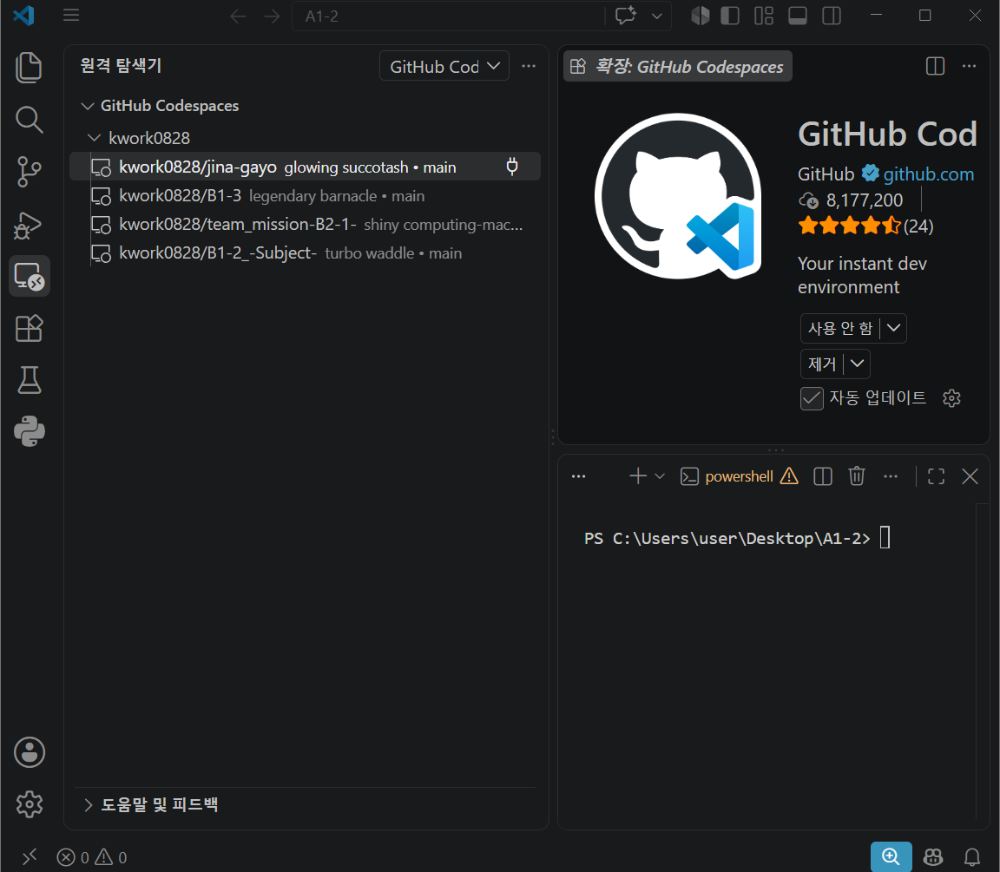

#### ▸ Python 버전 확인

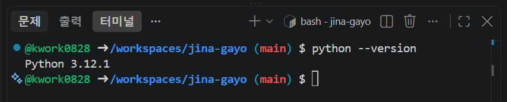

```bash
python --version
```

> 결과 `Python 3.12.1`. 로컬 PC는 3.14.7이지만 Codespace는 별개 컴퓨터라 버전이 다른 것이 정상이다.
> 과제 요건인 **3.10 이상**을 충족한다.

#### ▸ 폴더 구조 생성

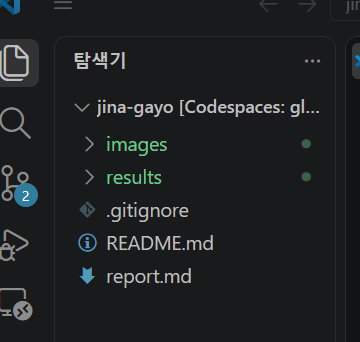

```bash
mkdir -p images results
touch images/.gitkeep results/.gitkeep
```

> `.gitkeep` 은 Git이 **빈 폴더를 저장하지 않는** 성질 때문에 넣은 빈 파일이다.

#### ▸ 라이브러리 설치

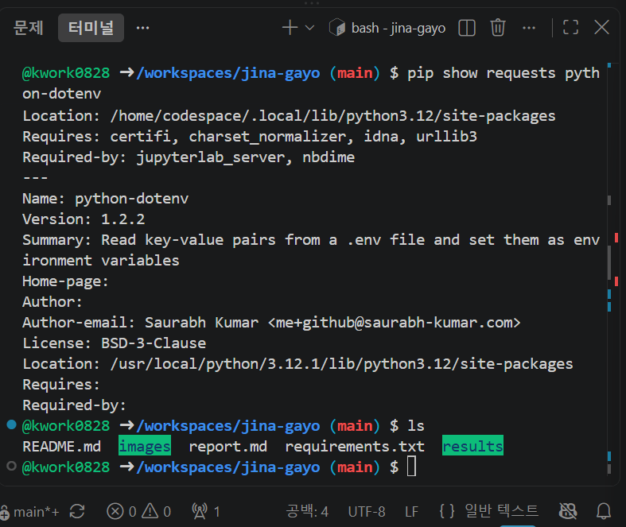

```bash
pip install requests python-dotenv
```

#### ▸ API 키 발급

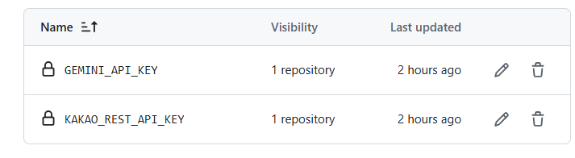

> 두 캡처 모두 **키 문자열을 가린 뒤** 저장했다. Gemini는 목록 화면이 뒷 4자리만 보여주고,
> 카카오는 전체가 보이므로 그림판으로 검은 사각형을 덧그렸다.

#### ▸ 키가 Git에 추적되지 않음을 확인

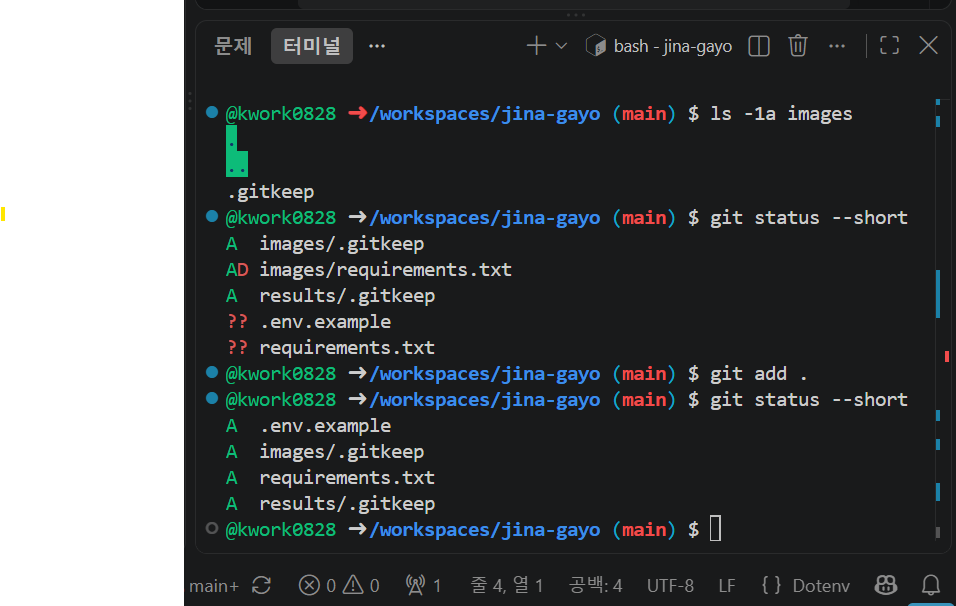

### 2-4. 최종 폴더 구조

```
jina-gayo/
├── .env.example              키 없는 견본 — 이것만 커밋
├── .gitignore                .env 차단 (151행)
├── README.md                 방문자용 안내
├── report.md                 평가자용 보고서 (이 문서)
├── requirements.txt
├── travel_planner.py         메인 프로그램
├── test_empty_result.py      검색 0건 상황 확인용 테스트
├── images/                   보고서용 캡처
└── results/                  실행 결과 (자동 생성)
    ├── 2026-03-15_raw.json
    └── 2026-03-15_travel_plan.md
```

### 2-5. requirements.txt

```txt
requests
python-dotenv
```

| 라이브러리 | 역할 |
|---|---|
| `requests` | HTTP 요청 도구. **Gemini(POST)·Kakao(GET) 두 API 모두 이걸로 직접 호출** |
| `python-dotenv` | `.env` 파일을 읽어 환경변수로 올림 |

> **왜 공식 SDK를 쓰지 않았나:** Google의 파이썬 SDK(`google-generativeai`)는 지원이 종료되었다.
> 그보다 중요한 이유는 **과제 목표가 "REST API의 요청/응답 구조를 설명할 수 있다"** 는 점이다.
> SDK를 쓰면 그 구조가 가려지므로, 두 API 모두 `requests` 로 직접 호출해
> **헤더·본문·상태 코드를 눈으로 확인**하며 작성했다.

---

## 3. 프로그램 구조

### 3-1. 전체 흐름도

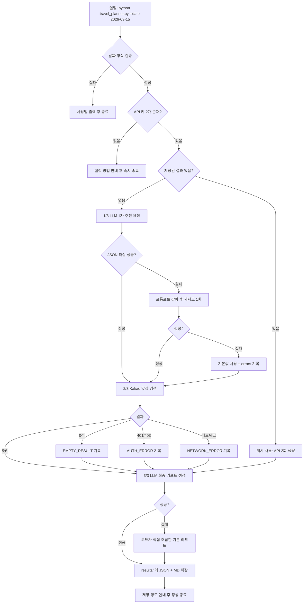

<details>
<summary>📐 텍스트 버전 흐름도 (Mermaid가 안 보일 때)</summary>

```
[CLI 입력]
    │
    ├─ 날짜 형식 틀림 ──────────────► 사용법 출력 후 종료
    ├─ API 키 없음 ────────────────► 설정 안내 후 즉시 종료
    ▼
[캐시 확인] ─ 있음 ────────────────► API 2회 생략하고 [3/3]로
    │ 없음
    ▼
[1/3] LLM 1차 추천 ──── 실패 ──────► 재시도 1회 ──► 실패 시 기본값 + errors
    ▼
[2/3] Kakao 맛집 검색 ─┬─ 0건 ─────► errors 기록, 계속 진행
                        ├─ 401/403 ─► errors 기록, 계속 진행
                        └─ 성공 5곳
    ▼
[3/3] LLM 최종 리포트 ── 실패 ─────► 코드가 조립한 기본 리포트로 대체
    ▼
[저장] results/{date}_raw.json  +  results/{date}_travel_plan.md
    ▼
[종료] 저장 경로 안내
```

</details>

> **설계 원칙 한 줄:** 중간 어느 단계가 실패해도 **리포트는 반드시 생성된다.**
> 실패는 지우지 않고 `errors` 배열에 남겨 리포트에 함께 출력한다.

### 3-2. 함수 표

| # | 함수명 | 입력 | 출력 | 역할 | 관련 요건 |
|---|---|---|---|---|---|
| 1 | `validate_date(s)` | `str` | `bool` | `YYYY-MM-DD` 형식·실존 날짜 검증 | 입력값 검증 |
| 2 | `parse_args()` | 터미널 인자 | `Namespace` | argparse로 `--date`·`--refresh` 수집 | CLI 인터페이스 |
| 3 | `load_api_keys()` | 없음 | `(str, str)` | 환경변수에서 키 로드, 없으면 안내 후 종료 | 보안·키 미설정 정책 |
| 4 | `add_error(...)` | — | 없음 | 오류를 목록에 기록만 하고 진행 | errors 관리 |
| 5 | `extract_json(text)` | `str` | `dict` | 응답에서 첫 JSON만 추출, 잘렸으면 복구 | 파싱 |
| 6 | `call_gemini(...)` | `str` | `str` | Gemini에 POST, 생성 텍스트 반환 | LLM 연동 |
| 7 | `build_prompt(...)` | `str` | `str` | 1차 추천 프롬프트 생성 (재시도용 포함) | 프롬프트 설계 |
| 8 | `get_recommendation(...)` | `str` | `dict` | 1차 추천 + 파싱 + 재시도 1회 | LLM 연동 |
| 9 | `to_float(v)` | `str` | `float`/`None` | 문자열 좌표를 숫자로 변환 | 타입 변환 |
| 10 | `search_restaurants(...)` | `str` | `list[dict]` | Kakao 맛집 5곳 검색, 실패 시 빈 목록 | 지도 API 연동 |
| 11 | `places_to_text(...)` | `list` | `str` | 맛집 목록을 프롬프트용 글로 변환 | 리포트 |
| 12 | `build_report_prompt(...)` | — | `str` | 최종 리포트 프롬프트 생성 | 리포트 |
| 13 | `build_fallback_report(...)` | — | `str` | LLM 실패 시 코드가 직접 조립한 리포트 | 에러 처리 |
| 14 | `append_errors_section(...)` | `str`,`list` | `str` | 오류 요약 절을 코드가 직접 덧붙임 | errors |
| 15 | `generate_report(...)` | — | `str` | 최종 리포트 생성 (실패 시 대체) | 리포트 생성 |
| 16 | `load_cache(date)` | `str` | `dict`/`None` | 같은 날짜 결과가 있으면 읽어옴 | 보너스(캐싱) |
| 17 | `save_results(...)` | — | `(Path, Path)` | `results/` 생성 후 JSON·MD 저장 | 결과 저장 |
| 18 | `main()` | 없음 | 없음 | 전체 흐름 조립 + 진행 로그 출력 | 전체 |

### 3-3. 실행 시퀀스 (실제 출력 로그)

```text
여행 날짜: 2026-03-15
[1/3] 1차 추천 생성 중(LLM)...
    - recommended_city : 경주
[2/3] 맛집 검색 중(지도/장소 API)...
    - 맛집 5곳 검색 완료
[3/3] 최종 리포트 생성 중(LLM)...
    - 리포트 생성 완료

완료! results/2026-03-15_travel_plan.md 를 확인하세요.
      원본 데이터는 results/2026-03-15_raw.json 에 있습니다.
      오류 기록 0건
```

---

## 4. 데이터 구조 설계

> 이 과제의 본질은 **"A라는 API의 출력을 B라는 API의 입력으로 바꾸는 것"** 이다.
> 그래서 자료형 선택이 곧 프로그램 설계였다.

### 4-1. 왜 자료형 설계가 먼저인가 — 비유

택배 물류센터를 떠올려 보자.

- **딕셔너리(dict)** = **이름표가 붙은 서랍장.** "도시", "날씨", "행사" 칸이 정해져 있어 `rec["recommended_city"]` 처럼 **이름으로 즉시** 꺼낸다. 순서는 상관없다.
- **리스트(list)** = **줄 세운 컨베이어 벨트.** 몇 개가 올지 모르고 순서가 의미를 가진다. 맛집이 5곳일 수도 0곳일 수도 있으니 벨트가 맞다.
- **리스트 안의 딕셔너리(list[dict])** = **벨트 위에 줄줄이 놓인 서랍장.** 맛집 하나하나가 이름·주소·분류 칸을 가진 서랍장이고, 그게 여러 개 흐른다.

즉 **"칸 이름이 고정 = dict / 개수가 유동 = list"** 라는 한 문장이 설계 기준이었다.

### 4-2. 자료형 선택 근거

| 데이터 | 선택 | 왜 이 자료형인가 | 다른 걸 썼다면 |
|---|---|---|---|
| 1차 추천 결과 | `dict` | 키 4개가 스키마로 **고정**. 이름으로 접근해야 다음 단계로 넘기기 쉽다 | `list`면 `rec[0]`처럼 **순서 의존** → 응답 순서가 바뀌면 조용히 깨진다 |
| 행사/축제 | `list[str]` | 개수가 1~3개로 유동, 순서 유지, 반복문 출력 | 콤마로 이은 `str`이면 개수 셀 때마다 다시 쪼개야 한다 |
| 맛집 목록 | `list[dict]` | 개수 유동(0~5) + 항목마다 고정 필드 | `dict`(가게명이 키)면 **동명 가게가 덮어써진다** |
| 오류 기록 | `list[dict]` | 발생 **순서**가 진단에 중요, 0건 가능 | `str` 누적이면 프로그램이 다시 읽어 처리할 수 없다 |
| 최종 리포트 | `str` (Markdown) | 사람이 읽는 최종 산출물, 파일로 바로 저장 | 구조화 자료형은 사람이 읽기 불편 |

### 4-3. 1차 추천 JSON 스키마

```json
{
  "recommended_city": "경주",
  "weather": "평균 기온 5~13도 내외로 선선하며 일교차가 큽니다.",
  "events": ["경주 벚꽃 축제"],
  "reason": "3월 중순 경주는 봄꽃이 피기 시작하는 시기입니다. 역사 유적과 함께 즐기기 좋습니다."
}
```

| 키 | 타입 | 필수 | 왜 이 타입인가 |
|---|---|---|---|
| `recommended_city` | `string` | ✅ | **이 값 하나가 2단계 Kakao 검색어가 된다.** 리스트면 검색어로 못 쓴다 |
| `weather` | `string` | ✅ | 사람이 읽는 요약 한 문장. 수치 분석이 목적이 아니다 |
| `events` | `array of string` | ✅ | 0~3개 유동. 리포트에서 불릿으로 반복 출력 |
| `reason` | `string` | ✅ | 2~4문장 서술형 |

> **가장 중요한 연결점:** `recommended_city` 값이 `f"{city} 맛집"` 으로 조립되어
> **Kakao API의 `query` 파라미터**로 들어간다. 이것이 요건에서 말하는
> "LLM 출력의 구조화 → 다음 단계 입력으로 활용"의 실체다.

### 4-4. 맛집 아이템 스키마와 필드 매핑

```json
{
  "name": "박용자경주명동쫄면 본점",
  "address": "경북 경주시 계림로93번길 3",
  "category": "음식점 > 한식 > 분식",
  "url": "http://place.map.kakao.com/8401833",
  "x": 129.2134,
  "y": 35.8371
}
```

| 우리 키 | 타입 | Kakao 원본 필드 | 비고 |
|---|---|---|---|
| `name` | string | `place_name` | 우리 스키마 이름으로 변환 |
| `address` | string | `road_address_name` (없으면 `address_name`) | 도로명 우선, 없으면 지번 |
| `category` | string | `category_name` | |
| `url` | string | `place_url` | |
| `x`, `y` | number | `x`(경도), `y`(위도) | Kakao는 **문자열**로 주므로 `float()` 변환 |

> ⚠️ Kakao의 `x`는 경도(longitude), `y`는 위도(latitude)다.
> 흔히 쓰는 `lat, lng` 순서와 **반대**라 헷갈리기 쉽다.

### 4-5. 오류 기록 스키마

```json
{ "step": "place_search", "type": "AUTH_ERROR", "message": "HTTP 401" }
```

| `step` | `type` | 발생 상황 |
|---|---|---|
| `llm_recommend` | `API_ERROR` | 호출 실패 (429/503 등) |
| `llm_recommend` | `PARSE_ERROR` | 1차 JSON 파싱 실패 |
| `llm_recommend` | `RETRY_FAILED` | 재시도 1회도 실패 |
| `place_search` | `EMPTY_RESULT` | 검색 결과 0건 |
| `place_search` | `AUTH_ERROR` | HTTP 401 / 403 |
| `place_search` | `QUOTA_ERROR` | HTTP 429 |
| `place_search` | `NETWORK_ERROR` | 타임아웃·연결 실패 |
| `llm_report` | `API_ERROR` | 최종 리포트 생성 실패 |

### 4-6. 최종 저장 JSON 전체 구조

```json
{
  "date": "2026-03-15",
  "generated_at": "2026-08-16T12:30:05",
  "recommendation": { "…4-3의 dict…" },
  "restaurants": [ "…4-4의 dict 0~5개…" ],
  "errors": [ "…4-5의 dict 0개 이상…" ]
}
```

> **왜 하나의 파일에 다 담았나:** 요건이 "원본 JSON에 1차 추천 + 맛집 결과 + errors 포함"을
> 요구했다. 파일을 쪼개면 **어느 실행의 결과끼리 짝인지** 추적이 어려워진다.
> 또한 이 구조 그대로가 **보너스 캐싱 기능의 입력**이 된다.

### 4-7. 이 설계의 장점과 한계

**장점**

| 항목 | 설명 |
|---|---|
| 그대로 저장 가능 | 전부 파이썬 기본 자료형이라 `json.dump()` 한 줄로 파일이 된다 |
| 부분 실패에 강함 | 맛집이 `[]`여도 리포트 생성이 멈추지 않는다 |
| 연결이 명시적 | `rec["recommended_city"]` 한 줄로 API 간 연결점이 코드에 드러난다 |
| 캐싱과 궁합 | 저장된 JSON만 다시 읽으면 API 호출 없이 리포트를 재생성할 수 있다 |

**한계와 개선 방향**

| 한계 | 왜 문제인가 | 개선안 |
|---|---|---|
| 타입 검증이 수동 | LLM이 `events`를 문자열로 주면 `for` 문이 글자 단위로 돈다 | `pydantic` 스키마 검증 도입 |
| 좌표계 정보 없음 | WGS84인지 문서에만 있고 데이터에는 없다 | `"coord_system": "WGS84"` 필드 추가 |
| 단일 도시 전제 | 복수 도시로 확장하려면 최상위 구조를 바꿔야 한다 | 처음부터 `cities: [...]` 배열로 설계 |
| 중복 제거 없음 | 지점만 다른 동일 브랜드가 5곳을 차지할 수 있다 | `name` 정규화 후 중복 제거 |

---

## 5. 기능별 실행 화면

> 각 기능을 **성공 사례**와 **예외 사례**로 나누어 검증했다.

### 5-1. CLI 사용법 출력

```bash
python travel_planner.py --help
```

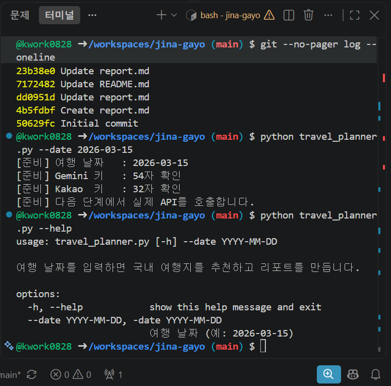

```text
usage: travel_planner.py [-h] --date YYYY-MM-DD [--refresh]

여행 날짜를 입력하면 국내 여행지를 추천하고 리포트를 만듭니다.

options:
  -h, --help            show this help message and exit
  --date YYYY-MM-DD, -date YYYY-MM-DD
                        여행 날짜 (예: 2026-03-15)
  --refresh             저장된 결과를 무시하고 API를 다시 호출합니다
```

### 5-2. ❌ 예외 — 잘못된 날짜 형식

```bash
python travel_planner.py --date 2026/03/15
```

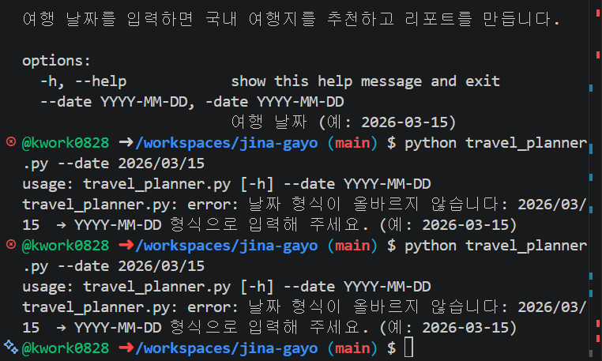

```text
usage: travel_planner.py [-h] --date YYYY-MM-DD [--refresh]
travel_planner.py: error: 날짜 형식이 올바르지 않습니다: 2026/03/15  → YYYY-MM-DD 형식으로 입력해 주세요. (예: 2026-03-15)
```

> `datetime.strptime()` 으로 형식과 **실존 여부**를 동시에 검증한다.
> `2026-02-30` 같은 없는 날짜도 이 방식이면 함께 걸러진다.

### 5-3. ❌ 예외 — API 키 미설정

```bash
env -u GEMINI_API_KEY -u KAKAO_REST_API_KEY python travel_planner.py --date 2026-03-15
```

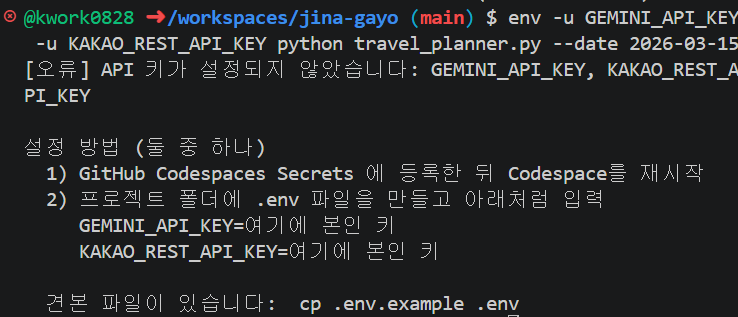

```text
[오류] API 키가 설정되지 않았습니다: GEMINI_API_KEY, KAKAO_REST_API_KEY

설정 방법 (둘 중 하나)
  1) GitHub Codespaces Secrets 에 등록한 뒤 Codespace를 재시작
  2) 프로젝트 폴더에 .env 파일을 만들고 아래처럼 입력
```

> 요건의 "키 미설정 시 **즉시 종료** + 설정 방법 안내"에 해당한다.
> 키 없이 호출하면 무의미한 401만 쌓이므로 **출발 전에 막는 것**이 옳다.
> 검증 시 실제 Secrets를 지우지 않고 `env -u` 로 해당 변수만 잠시 없앤 상태를 만들었다.

### 5-4. ✅ LLM 1차 추천 (JSON 구조화 성공)

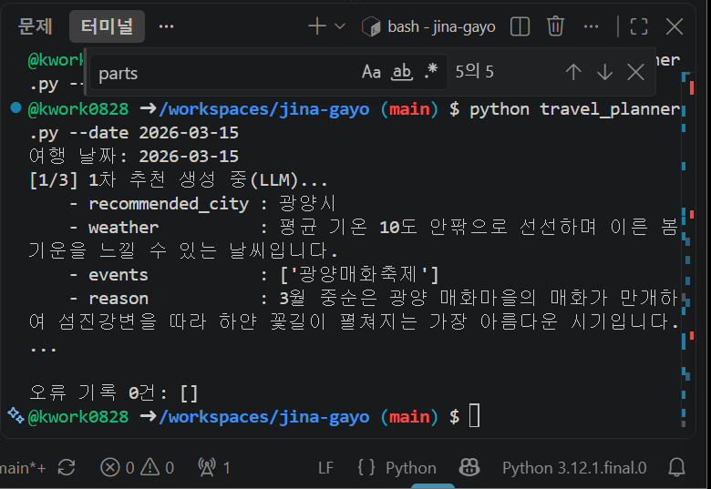

```text
[1/3] 1차 추천 생성 중(LLM)...
    - recommended_city : 경주
    - weather          : 평균 기온 5~13도 내외로 선선하며 일교차가 큽니다.
    - events           : ['경주 벚꽃 축제']
```

### 5-5. ✅ 맛집 검색 성공 (5곳)

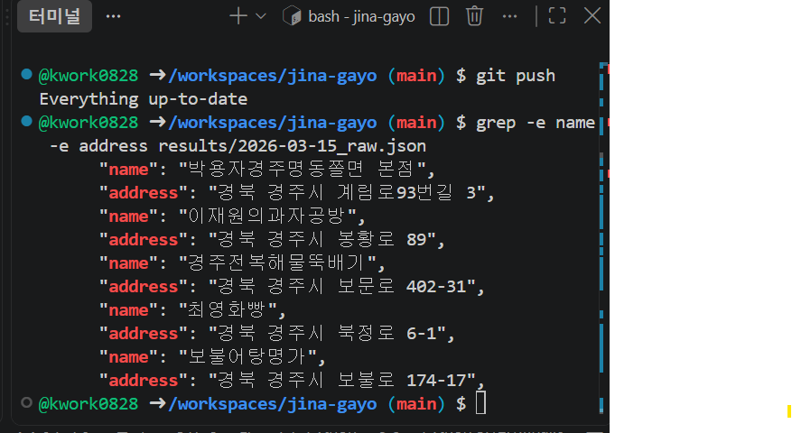

```text
"name": "박용자경주명동쫄면 본점",
"address": "경북 경주시 계림로93번길 3",
"name": "이재원의과자공방",
"address": "경북 경주시 봉황로 89",
"name": "경주전복해물뚝배기",
"address": "경북 경주시 보문로 402-31",
"name": "최영화빵",
"address": "경북 경주시 북정로 6-1",
"name": "보불어탕명가",
"address": "경북 경주시 보불로 174-17",
```

> 요건이 요구한 최소 필드(name / address / category / url / x / y)가 모두 저장된다.

### 5-6. ❌ 예외 — 검색 결과 0건

> 검증 방법: 존재하지 않는 지역명(`zzqqxx없는지역명`)으로 `search_restaurants()` 를 직접 호출하는
> 테스트 스크립트 `test_empty_result.py` 를 작성했다.

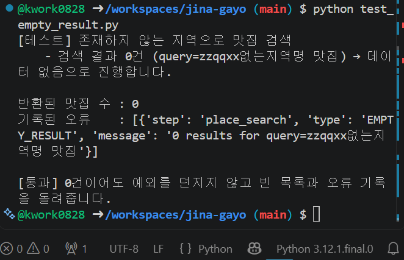

```text
[테스트] 존재하지 않는 지역으로 맛집 검색
    - 검색 결과 0건 (query=zzqqxx없는지역명 맛집) → 데이터 없음으로 진행합니다.

반환된 맛집 수 : 0
기록된 오류    : [{'step': 'place_search', 'type': 'EMPTY_RESULT', ...}]

[통과] 0건이어도 예외를 던지지 않고 빈 목록과 오류 기록을 돌려줍니다.
```

> 프로그램이 중단되지 않고 리포트에 `데이터 없음`으로 표기하며 진행한다.

### 5-7. ❌ 예외 — 인증 실패 (401)

> 검증 방법: 실제 키를 건드리지 않고 `KAKAO_REST_API_KEY=INVALID_KEY_FOR_TEST` 를
> 명령 앞에 붙여 **그 한 번의 실행에만** 잘못된 키를 적용했다.

```bash
KAKAO_REST_API_KEY=INVALID_KEY_FOR_TEST python travel_planner.py --date 2026-03-15
```

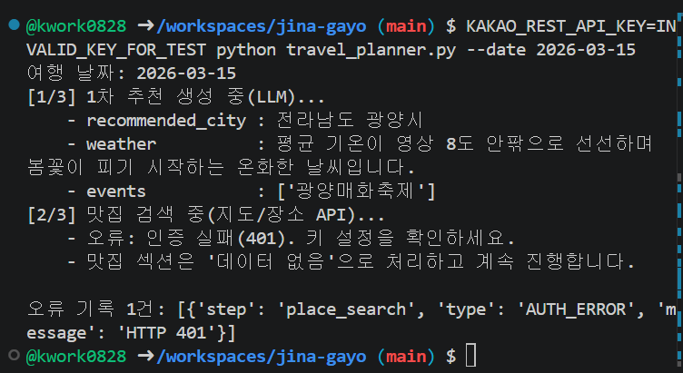

```text
[2/3] 맛집 검색 중(지도/장소 API)...
    - 오류: 인증 실패(401). 키 설정을 확인하세요.
    - 맛집 섹션은 '데이터 없음'으로 처리하고 계속 진행합니다.
오류 기록 1건: [{'step': 'place_search', 'type': 'AUTH_ERROR', 'message': 'HTTP 401'}]
```

### 5-8. ❌ 예외 — LLM 쿼터 초과(429) 시 기본 리포트 대체

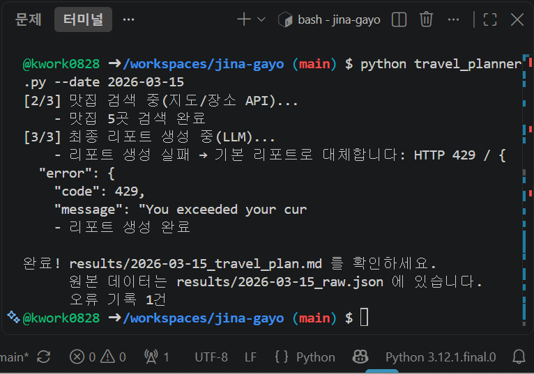

```text
[3/3] 최종 리포트 생성 중(LLM)...
    - 리포트 생성 실패 → 기본 리포트로 대체합니다: HTTP 429
    - 리포트 생성 완료

완료! results/2026-03-15_travel_plan.md 를 확인하세요.
      오류 기록 1건
```

> **가장 중요한 화면이다.** LLM이 응답하지 못해도 파이썬이 직접 조립한 리포트가 생성되어
> 최종 산출물은 반드시 나온다. 요건 "LLM 실패 시에도 리포트 생성은 계속 진행"의 직접 증빙이다.

### 5-9. ✅ 전체 실행 완료

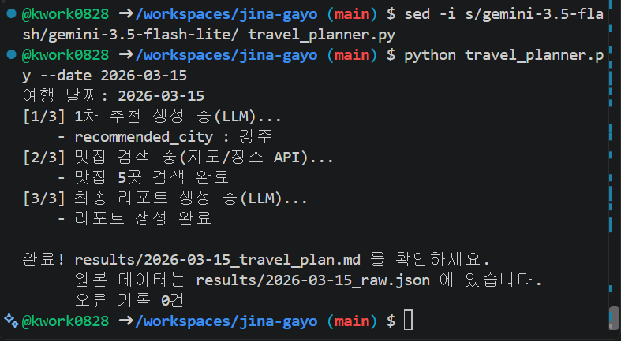

### 5-10. ✅ 결과 파일 생성 확인

```bash
ls -l results
```

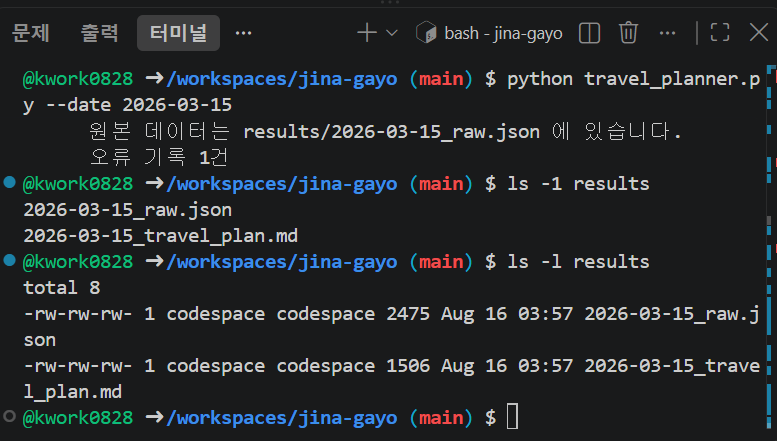

### 5-11. ✅ 생성된 리포트 미리보기

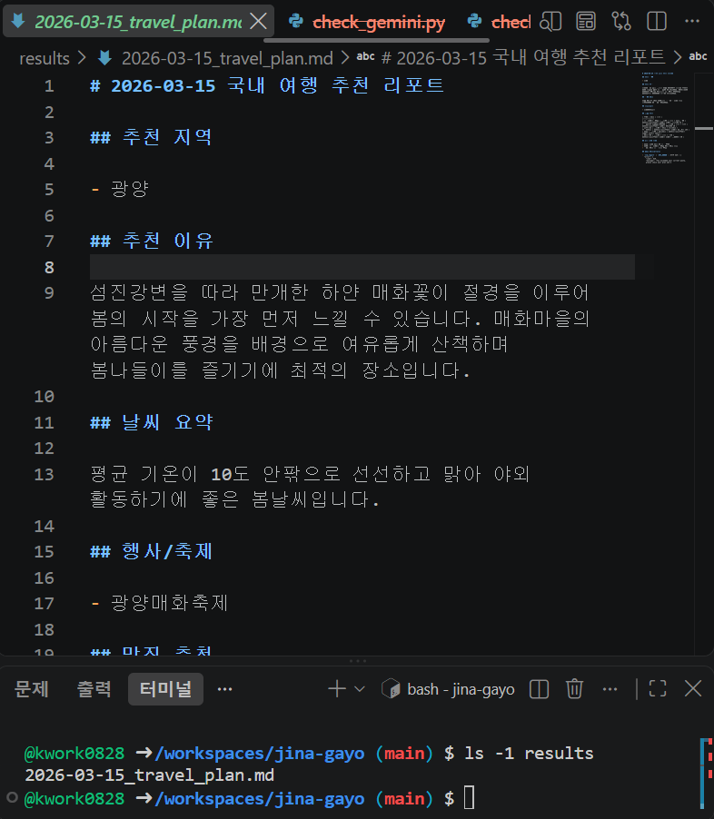

### 5-12. ✅ 원본 JSON

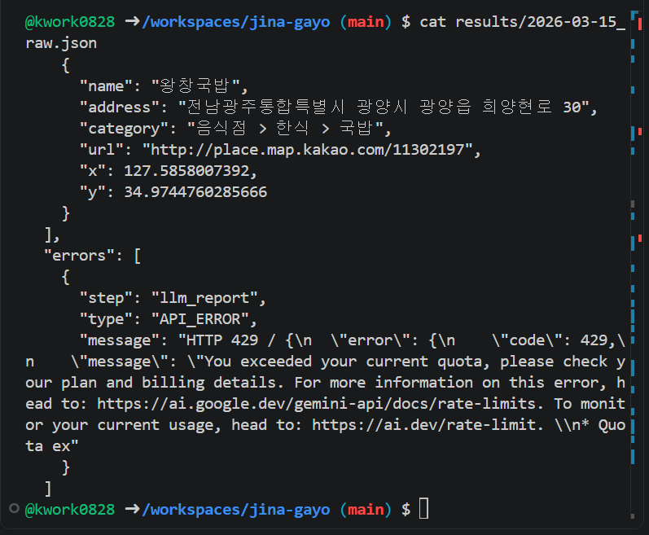

### 5-13. 🎁 보너스 — 결과 캐싱

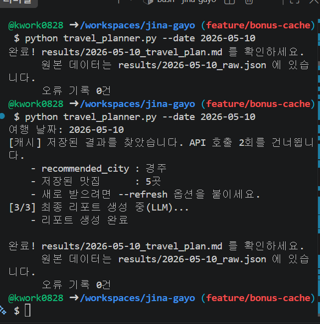

```text
여행 날짜: 2026-05-10
[캐시] 저장된 결과를 찾았습니다. API 호출 2회를 건너뜁니다.
    - recommended_city : 경주
    - 저장된 맛집      : 5곳
    - 새로 받으려면 --refresh 옵션을 붙이세요.
[3/3] 최종 리포트 생성 중(LLM)...
```

> 동일 `--date` 재실행 시 저장된 JSON을 재사용해 API 호출 2회를 건너뛴다.
> `--refresh` 옵션을 주면 캐시를 무시하고 새로 호출한다.
> **API 비용과 응답 시간을 동시에 절약**하는 가장 기본적인 최적화다.

---

## 6. API 키 보안 조치

> 요건에서 보안이 **필수 제약**으로 명시되어 별도 장으로 정리한다.

### 6-1. 왜 키를 코드에 쓰면 안 되는가

| 이유 | 설명 |
|---|---|
| 공유 사고 방지 | 저장소가 Public이면 키가 **전 세계에 공개**된다. 봇이 수 분 내에 수집한다 |
| 교체 용이성 | 유출돼도 키만 새로 발급하면 된다. 코드 수정·재배포가 필요 없다 |
| 과금 사고 예방 | 유출된 키로 타인이 호출하면 **내 계정에 요금이 청구**된다 |
| 환경별 분리 | 개발용·운영용 키를 코드 변경 없이 바꿔 끼울 수 있다 |

### 6-2. 실제 적용한 5중 방어

| # | 조치 | 확인 방법 |
|---|---|---|
| 1 | 저장소 생성 시부터 `.gitignore`에 `.env` 포함 | `git status` 에 `.env` 미표시 |
| 2 | **Codespaces Secrets** 에 키 보관 (계정 단위 암호화 저장) | 키가 파일로 존재하지 않음 |
| 3 | `.env.example` 만 커밋 (키 자리에 `YOUR_KEY_HERE`) | 저장소에서 파일 확인 |
| 4 | 코드는 `os.getenv()` 로만 접근, 리터럴 키 0개 | `grep` 검색 시 0건 |
| 5 | 로그·리포트·캡처에 키 미출력, **예외 메시지도 가공** | `type(e).__name__` 만 출력 |

> **환경변수와 `.env` 두 방식을 모두 지원한 이유:** Codespaces Secrets는 클라우드 환경에서
> 자동 주입되어 편하지만, 다른 사람이 로컬에서 실행할 땐 쓸 수 없다.
> 그래서 `.env` 도 함께 지원해 **어느 환경에서든 동작**하도록 했다.

### 6-3. 키 존재 확인 방식 — 값을 보지 않는다

```bash
echo ${#GEMINI_API_KEY} ${#KAKAO_REST_API_KEY}
```

```text
53 32
```

> 키가 제대로 들어왔는지는 **글자 수만** 확인했다. 값을 화면에 띄우는 순간
> 캡처·터미널 기록·스크롤 버퍼에 남기 때문이다.

### 6-4. `.env.example` (저장소에 올라간 파일)

```dotenv
GEMINI_API_KEY=YOUR_GEMINI_KEY_HERE
KAKAO_REST_API_KEY=YOUR_KAKAO_REST_API_KEY_HERE
```

### 6-5. 키가 추적되지 않음을 증명

```bash
git status --short
```

```text
A  .env.example
A  images/.gitkeep
A  requirements.txt
A  results/.gitkeep
```

> 목록에 `.env` 가 **없다.** `.gitignore` 151행의 `.env` 규칙이 작동하고 있다는 증거다.

---

## 7. 버전 관리 과정

### 7-1. 커밋 전략

> **원칙: "기능 하나 = 커밋 하나."**
> 오류가 났을 때 어느 커밋에서 깨졌는지 되짚기 쉽고,
> 커밋 로그 자체가 개발 순서를 보여주는 기록이 되기 때문이다.

### 7-2. 커밋 메시지 규칙

| 접두어 | 뜻 | 실제 사용 예 |
|---|---|---|
| `feat` | 새 기능 | `feat: add argparse CLI with date validation and api key check` |
| `fix` | 버그 수정 | — |
| `docs` | 문서 | `docs: write README` |
| `chore` | 설정·잡무 | `chore: add requirements and env example` |
| `test` | 테스트 | `test: add empty result test and screenshots` |
| `merge` | 병합 | `merge: bonus cache feature` |

> ✍️ 커밋 메시지는 **전부 영문**으로 작성했다.
> 터미널 인코딩 설정에 따라 한글이 깨져 기록되는 사고가 잦고,
> 한 번 커밋되면 되돌리기가 번거롭기 때문이다.

### 7-3. 실제 커밋 이력 (원문)

```bash
git --no-pager log --oneline --graph --all
```

```text
*   35ec3ab (HEAD -> main, origin/main, origin/HEAD) merge: bonus cache feature
|\  
| * ca2b404 (origin/feature/bonus-cache, feature/bonus-cache) feat: add result caching
|/  
* e0a7508 chore: fix screenshot filename
* 4b89673 test: add empty result test and screenshots
* 437e29a feat: report generation and results saving
* 01bfe20 feat: kakao restaurant search
* 13ee1fc feat: gemini recommendation
* 05e7e85 feat: add argparse CLI with date validation and api key check
* 0f71fbf docs: add setup screenshots
*   335f62c Merge branch 'main' of https://github.com/kwork0828/jina-gayo
|\  
| * 17a6258 Update report.md
| * fed4660 Update report.md
| * 14987d7 Update report.md
| * 5e20024 Update report.md
| * 25f3212 Update report.md
| * 17f49fd Update report.md
| * e222509 Update report.md
| * 731c344 Update report.md
| * 97149f5 Update report.md
| * 3bc9fe5 Update title formatting in report.md
| * 23b38e0 Update report.md
| * 7172482 Update README.md
| * dd0951d Update report.md
* | 3581b89 chore: add requirements and env example
|/  
* 4b5fdbf Create report.md
* 50629fc Initial commit
```

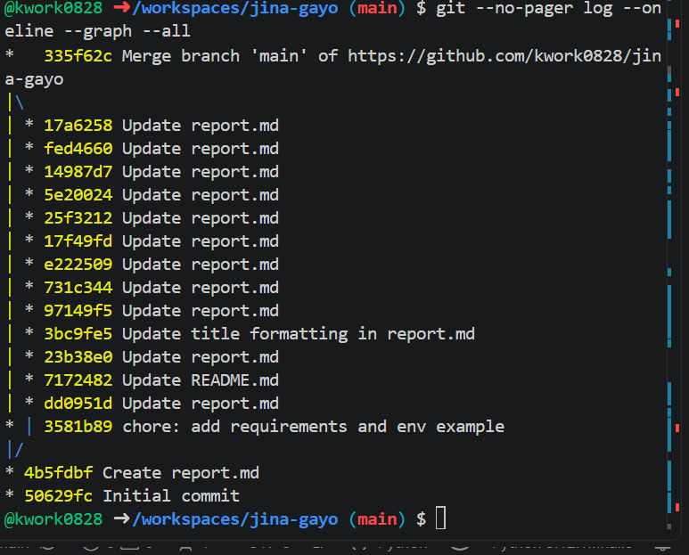

> 그래프에 **갈라짐(`|\`)과 합쳐짐(`|/`)이 두 군데** 보인다.
> 아래쪽은 GitHub 웹과 Codespace에서 같은 파일을 동시에 고쳐 생긴 병합이고(8-2절 ④),
> 위쪽이 의도적으로 만든 **보너스 기능 브랜치의 병합**이다.

### 7-4. 브랜치 전략

```
main ────●────●────●────●──────────────●──── (제출)
                          \            /
feature/bonus-cache        ●──────────●
                        캐싱 구현    --no-ff 병합
```

| 브랜치 | 목적 | 처리 |
|---|---|---|
| `main` | 항상 동작하는 안정 버전 | 제출 기준 |
| `feature/bonus-cache` | 보너스(캐싱) 실험 | `--no-ff` 로 `main`에 병합 |

> **왜 브랜치를 나눴나:** 보너스는 실패해도 되는 실험이다.
> 본 줄기에서 바로 고치면 이미 완성한 필수 기능까지 망가질 위험이 있어,
> **가지를 쳐서 실험하고 성공했을 때만 합쳤다.**

> **왜 `--no-ff` 인가:** 이 옵션이 없으면 Git이 브랜치를 **일직선으로 펴버려서**
> "가지를 쳐서 작업했다"는 흔적이 사라진다. 이력을 남기는 것이 목적이므로 반드시 붙였다.

---

## 8. 시행착오와 해결

> 실제로 겪은 오류만 기록한다. 각 항목은 **원인 → 해결 → 재발 방지** 순서다.

### 8-1. 요약

| # | 증상 | 원인 유형 | 해결 |
|---|---|---|---|
| 1 | Windows 명령이 Codespaces에서 안 먹힘 | 환경 차이 | bash 문법으로 전환 |
| 2 | 새 파일이 엉뚱한 폴더에 생성됨 | 도구 미숙 | 탐색기 선택 해제 후 생성 |
| 3 | 붙여넣기 도중 따옴표가 안 닫혀 터미널이 멈춤 | 입력 실수 | `Ctrl+C` 탈출, 따옴표 없는 명령 사용 |
| 4 | `git push` 거부 (divergent branches) | 버전 관리 | `pull.rebase false` 후 merge로 통합 |
| 5 | API 키 세부정보 캡처에 키 전체 노출 | 보안 | 키 폐기 후 재발급 |
| 6 | 오류 메시지에 API 키 전체가 출력됨 | 보안 | `.strip()` + 예외 메시지 가공 |
| 7 | 모델 404 "신규 사용자에게 제공되지 않음" | 외부 API 변경 | 사용 가능 조합을 코드로 탐색해 확정 |
| 8 | LLM 응답 JSON이 중간에서 잘림 | 파싱/설정 | `maxOutputTokens` 확대 + `finishReason` 검사 |
| 9 | 검증 스크립트는 성공하는데 본 코드만 파싱 실패 | 파싱 | 괄호 짝 세기 방식으로 교체 |
| 10 | 모델이 JSON을 닫지 않고 끝냄 | 파싱 | 열린 괄호를 닫아 복구 |
| 11 | 카카오 403 NotAuthorizedError | 권한 | 앱의 카카오맵 서비스 활성화 |
| 12 | Gemini 하루 무료 쿼터(429) 소진 | 쿼터 | `flash-lite` 모델 교체 + 캐싱 도입 |

### 8-2. 상세

#### ① Windows 명령이 통하지 않음

```text
dir: command not found
```

- **원인:** GitHub Codespaces는 **Ubuntu 리눅스**이고 터미널이 bash다. Windows PowerShell 명령(`dir`, `$env:`, `\` 경로)은 존재하지 않는다.
- **해결:** `dir` → `ls`, `$env:KEY="값"` → `export KEY="값"`, 경로 구분자 `\` → `/` 로 전부 바꿨다.
- **재발 방지:** 명령을 치기 전에 **"지금 내가 있는 곳이 Windows인가 리눅스인가"** 를 먼저 떠올린다. 클라우드 개발 환경을 쓴다는 건 곧 **남의 리눅스 컴퓨터를 빌려 쓰는 것**임을 이해하게 됐다.

#### ② 터미널이 `>` 만 뜨고 멈춤

```text
$ git commit -m "feat: add gemini recommendation
> 
```

- **원인:** 명령을 복사할 때 **닫는 따옴표가 빠져** 셸이 "문장이 아직 안 끝났다"고 판단해 계속 입력을 기다린 것이다.
- **해결:** `Ctrl + C` 로 즉시 빠져나왔다. 이후 명령에서는 **따옴표를 최소화**하고, 커밋 메시지를 짧게 유지했다.
- **재발 방지:** `>` 프롬프트는 오류가 아니라 **"입력이 안 끝났다"는 신호**다. 탈출 방법(`Ctrl+C`)을 먼저 익혀두면 당황하지 않는다.

#### ③ API 키 세부정보 캡처에 키가 노출됨

- **원인:** 키가 잘 발급됐는지 확인하려고 "세부정보" 창을 열어 캡처했다. 목록 화면은 뒷 4자리만 보여주지만, 세부정보 창은 **전체 키를 그대로 노출**한다.
- **해결:** 노출된 키를 즉시 삭제하고 새로 발급했다. API 키는 비밀번호와 달리 **"폐기 후 재발급"이 즉시 가능**하다는 점이 오히려 방어 수단이다.
- **재발 방지:** 키는 **"확인하지 않는다"** 를 원칙으로 삼았다. 잘 발급됐는지는 세부정보 창이 아니라 **실제 API 호출 성공 여부**로 판단한다.

#### ④ `git push` 거부 — divergent branches

```text
! [rejected]  main -> main (fetch first)
fatal: Need to specify how to reconcile divergent branches.
```

- **원인:** 같은 파일(`report.md`)을 **GitHub 웹과 Codespace 두 곳에서** 편집해 이력이 갈라졌다. Git은 한쪽을 덮어써 작업이 사라지는 것을 막기 위해 push를 거부한다.
- **해결:** merge 방식을 지정(`git config pull.rebase false`)하고 `git pull --no-edit` 로 통합한 뒤 push했다.
- **재발 방지:** **한 파일은 한 곳에서만 편집한다.** 작업 시작 전 `git pull` 을 먼저 실행하는 습관을 들였다.

#### ⑤ 오류 메시지에 API 키 전체가 출력됨

```text
ValueError: Invalid header value b'AQ.Ab8...\n'
```

- **원인:** GitHub Secrets에 키를 붙여넣을 때 눈에 보이지 않는 **줄바꿈(`\n`)** 이 함께 들어갔다. HTTP 헤더에는 줄바꿈을 넣을 수 없어 파이썬이 예외를 냈는데, **그 오류 메시지에 헤더 값(=키)이 그대로 실렸다.**
- **해결:** 노출된 키를 폐기·재발급했다. 코드에는 `.strip()` 으로 앞뒤 공백·줄바꿈을 제거하고, `except` 블록에서 예외 메시지 대신 `type(e).__name__` 만 출력하도록 바꿨다.
- **재발 방지:** 키 유출 경로는 캡처와 커밋만이 아니다. **오류 로그와 터미널 출력도 유출 경로**다. 예외를 그대로 `print` 하지 않는다.

#### ⑥ 모델 404 — "신규 사용자에게 제공되지 않는 모델"

```text
HTTP 404 / "This model models/gemini-2.5-flash is no longer available to new users."
```

- **원인:** 자료를 보고 "가장 널리 쓰이는 안정 모델"을 골랐으나, 그 모델은 기존 사용자에게만 열려 있고 신규 계정에는 닫혀 있었다. **모델 목록 조회(GET)에는 이름이 보였지만 실제 생성 호출(POST)은 404**였다.
- **해결:** "목록에 보이는 것"과 "쓸 수 있는 것"은 다르다고 판단하고, 후보 모델과 호출 방식을 조합해 상태 코드를 찍어보는 **탐색 스크립트**를 만들어 실제 동작 조합을 확정했다.
- **재발 방지:** 외부 API는 문서보다 빨리 바뀐다. 추측하지 말고 **가장 작은 요청 하나로 먼저 확인**한 뒤 본 코드를 작성한다.

#### ⑦ LLM 응답 JSON이 중간에서 잘림

- **원인:** `maxOutputTokens` 는 '답변 길이' 한도가 아니라 **'모델의 생각 + 답변' 합계** 한도였다. 최신 모델은 답하기 전에 내부적으로 추론을 하는데, 그 추론이 한도를 대부분 소비해 정작 답변이 문장 중간에서 잘렸다.
- **해결:** 한도를 2048 → 8192로 올리고, 응답의 `finishReason` 이 `STOP` 이 아니면 "잘렸다"고 명시적으로 알리도록 했다.
- **재발 방지:** "파싱 실패"라는 **증상만 보고 파서를 고치려 들면 원인을 놓친다.** 응답 원문과 메타 정보를 먼저 확인한다.

#### ⑧ 검증 스크립트는 성공하는데 본 코드만 파싱 실패

- **원인:** 응답을 잘라내는 함수를 "첫 `{` 부터 마지막 `}` 까지"로 만들었는데, 모델이 JSON을 두 번 출력하면 `{A}{B}` 를 통째로 잘라 파싱이 깨졌다. 검증용 스크립트는 `json.loads()` 를 그대로 써서 이 결함을 지나쳤다.
- **해결:** **괄호의 짝(깊이)을 세어 첫 번째 완전한 JSON만** 잘라내도록 바꿨다. 문자열 안의 중괄호와 이스케이프된 따옴표도 건너뛰도록 처리했다.
- **재발 방지:** 같은 입력인데 결과가 다르면 **입력이 아니라 처리 코드**를 의심한다. "가장 단순한 버전은 되는데 내 코드는 안 된다"가 결정적 단서였다.

#### ⑨ 모델이 JSON을 닫지 않고 끝냄

- **원인:** 응답 상태는 정상 종료(`STOP`)인데 JSON의 마지막 닫는 괄호가 빠진 채로 왔다. **LLM은 확률적으로 다음 글자를 고르기 때문에, 형식을 지시했다고 해서 반드시 지키는 것은 아니다.**
- **해결:** ① 괄호 짝을 세다가 응답이 끊기면 열린 괄호를 닫아 **부분 응답을 복구**하고, ② 프롬프트에서 답변 길이를 제한해 잘릴 여지 자체를 줄였다.
- **재발 방지:** LLM 출력은 "대체로 맞지만 가끔 틀리는 입력"으로 취급한다. **형식 지시(프롬프트) → API 강제(responseMimeType) → 정제(파서) → 복구(부분 응답) → 재시도(1회) → 기본값**. 다섯 겹의 방어를 두었다.

#### ⑩ 카카오 403 NotAuthorizedError

```text
{"errorType":"NotAuthorizedError","message":"App(jina-gayo) disabled OPEN_MAP_AND_LOCAL service."}
```

- **원인:** 키는 올바른 REST API 키였지만, 앱에서 **지도/로컬 서비스가 꺼져 있어** 거부됐다.
- **401과 403의 차이:**
  - `401 Unauthorized` = **"당신이 누구인지 모르겠다"** (키 자체가 틀림)
  - `403 Forbidden` = **"누구인지는 알겠는데 이건 못 준다"** (권한 부족)
  - → 403에서 키를 다시 발급받았다면 시간만 낭비했을 것이다.
- **해결:** 응답 본문의 `errorType` / `message` 를 읽고 콘솔에서 해당 서비스를 켰다.
- **재발 방지:** **상태 코드만 보지 말고 응답 본문을 반드시 읽는다.** API 제공자는 대개 거부 이유를 본문에 적어 보낸다.

#### ⑪ Gemini 하루 무료 쿼터(429) 소진

- **원인:** 개발 중 오류를 찾느라 같은 요청을 반복 호출해 하루 한도를 다 썼다.
- **해결:** ① 무료 한도가 더 넉넉한 `flash-lite` 모델로 교체, ② 보너스 기능인 **결과 캐싱**을 넣어 같은 날짜 재실행 시 호출을 생략하도록 했다.
- **배운 점:** 캐싱은 "있으면 좋은 기능"이 아니라 **개발 중 쿼터를 지키는 실질적 수단**이었다. 보너스 과제의 취지("API 비용·속도 최적화")를 몸으로 이해했다.
- **덧붙임:** 429가 났을 때도 프로그램은 기본값으로 진행해 리포트를 만들어냈다. 예외 처리 설계가 실제 상황에서 검증된 셈이다.

---

## 9. 요건 충족 체크리스트

> 과제 요건 원문을 한 줄 단위로 쪼개고, 각 항목의 충족 근거를 명시한다.

### 9-1. 최종 결과물

| # | 요건 원문 | 충족 | 근거 |
|---|---|:--:|---|
| 1 | CLI 기반 Python 프로그램 | ✅ | `travel_planner.py`, argparse 기반 · `images/07-cli-help.png` |
| 2 | 입력: `-date "YYYY-MM-DD"` (필수) | ✅ | `required=True`, `--date` 와 `-date` 양쪽 허용 |
| 3 | 출력: 진행 로그 | ✅ | `[1/3]` `[2/3]` `[3/3]` · `images/12-run-complete.png` |
| 4 | 출력: 결과 저장 경로 안내 | ✅ | 종료 시 `완료! results/... 를 확인하세요` |
| 5 | `results/` 폴더에 결과 생성 | ✅ | `images/14-results-folder.png` |
| 6 | 원본 데이터 JSON 1개 이상 | ✅ | `results/{date}_raw.json` |
| 7 | └ 1차 추천 결과 포함 | ✅ | `recommendation` 키 · `images/16-raw-json.png` |
| 8 | └ 맛집 검색 결과 포함 | ✅ | `restaurants` 키 · `images/17-restaurants-detail.png` |
| 9 | 최종 여행 리포트 Markdown 1개 | ✅ | `results/{date}_travel_plan.md` |
| 10 | README — 프로그램 개요 | ✅ | README 「어떻게 동작하나요」 |
| 11 | README — 실행 방법 | ✅ | README 「실행 방법」 |
| 12 | README — API 키 설정 방법 | ✅ | README 「API 키 설정」 (방법 A/B/C) |
| 13 | README — 결과물 확인 방법 | ✅ | README 「결과물 확인」 |
| 14 | README — 키 유출 주의사항 | ✅ | README 「API 키 관리」 |

### 9-2. CLI 인터페이스

| # | 요건 원문 | 충족 | 근거 |
|---|---|:--:|---|
| 15 | argparse 활용 | ✅ | `parse_args()` |
| 16 | 필수 옵션 `-date` | ✅ | `required=True` |
| 17 | 날짜 형식 오류 시 사용법 출력 후 종료 | ✅ | `parser.error()` · `images/08-cli-date-error.png` |

### 9-3. API 제공자 선택

| # | 요건 원문 | 충족 | 근거 |
|---|---|:--:|---|
| 18 | LLM API 택1 (OpenAI / Gemini) | ✅ | **Google Gemini** (`gemini-3.5-flash-lite`) |
| 19 | 지도/장소 API 택1 (Kakao / Naver) | ✅ | **Kakao Local** 키워드 장소 검색 |
| 20 | 응답을 JSON으로 수신 | ✅ | 두 API 모두 JSON |
| 21 | 최소 필드 확보 (place_name / address / lat·lng / url) | ✅ | 4-4절 매핑표 · `images/17-restaurants-detail.png` |

### 9-4. LLM 1차 추천

| # | 요건 원문 | 충족 | 근거 |
|---|---|:--:|---|
| 22 | 입력: 사용자 `date` | ✅ | `build_prompt()` 에 날짜 삽입 |
| 23 | JSON 파싱 가능 텍스트 강제 프롬프트 | ✅ | 프롬프트 지시 + `responseMimeType: application/json` |
| 24 | `recommended_city` : string | ✅ | `images/10-llm-recommendation.png` |
| 25 | `weather` : string | ✅ | 동일 |
| 26 | `events` : array of string (1~3개) | ✅ | 동일 |
| 27 | `reason` : string (2~4문장) | ✅ | 동일 |

### 9-5. 지도/장소 검색

| # | 요건 원문 | 충족 | 근거 |
|---|---|:--:|---|
| 28 | 입력: 1차 JSON의 `recommended_city` | ✅ | `f"{city} 맛집"` 을 `query` 로 전달 |
| 29 | 맛집 N곳(권장 5곳) 검색 | ✅ | `PLACE_COUNT = 5` |
| 30 | `name` | ✅ | `place_name` 매핑 |
| 31 | `address` | ✅ | `road_address_name` 우선, 없으면 `address_name` |
| 32 | `category` | ✅ | `category_name` |
| 33 | `url` | ✅ | `place_url` |
| 34 | `x, y` 또는 `lat, lng` | ✅ | 문자열을 `float()` 로 변환해 저장 |
| 35 | 인증 헤더로 키 전송 | ✅ | `Authorization: KakaoAK {키}` |
| 36 | 0건이어도 중단 없이 다음 단계 진행 | ✅ | `images/18-place-search-empty.png` |

### 9-6. 최종 리포트

| # | 요건 원문 | 충족 | 근거 |
|---|---|:--:|---|
| 37 | 입력: 1차 JSON + 맛집 목록(0건 가능) | ✅ | `generate_report()` |
| 38 | Markdown 텍스트로 생성 | ✅ | `.md` 저장 |
| 39 | 추천 지역 + 추천 이유 요약 | ✅ | `images/15-report-preview.png` |
| 40 | 날씨 요약 | ✅ | 동일 |
| 41 | 행사/축제 목록 | ✅ | 동일 |
| 42 | 맛집 리스트 (0건이면 "데이터 없음") | ✅ | 동일 |
| 43 | 1일 일정 제안 (오전/오후/저녁) | ✅ | 동일 |

### 9-7. 에러 처리

| # | 요건 원문 | 충족 | 근거 |
|---|---|:--:|---|
| 44 | try-except로 호출·파싱 오류 처리 | ✅ | 모든 API 호출부 |
| 45 | 키 미설정: 즉시 종료 + 설정 방법 안내 | ✅ | `images/09-nokey-exit.png` |
| 46 | 지도 API 실패: "데이터 없음" + 리포트 계속 | ✅ | `images/11-place-search-401.png` |
| 47 | LLM JSON 파싱 실패: 재시도 **1회** | ✅ | `MAX_RETRY = 1` 상수로 고정 |
| 48 | 내부 오류 목록 관리 (`errors`) | ✅ | `add_error()` · 리포트 「오류 요약」 절 |

### 9-8. 보안

| # | 요건 원문 | 충족 | 근거 |
|---|---|:--:|---|
| 49 | 키를 코드에 직접 작성하지 않음 | ✅ | `os.getenv()` 만 사용 |
| 50 | 환경변수 또는 `.env` 에서 읽음 | ✅ | Codespaces Secrets + python-dotenv |
| 51 | README·로그·결과물에 키 미노출 | ✅ | 6장 5중 방어 |
| 52 | `.gitignore` 로 `.env` 차단 | ✅ | `.gitignore` 151행 · `images/05-git-status-no-env.png` |

### 9-9. 결과 저장

| # | 요건 원문 | 충족 | 근거 |
|---|---|:--:|---|
| 53 | `results/` 폴더 생성 | ✅ | `mkdir(parents=True, exist_ok=True)` |
| 54 | 실행 날짜 기준 파일명 | ✅ | `{date}_raw.json`, `{date}_travel_plan.md` |
| 55 | 원본 JSON에 1차 추천 포함 | ✅ | `recommendation` |
| 56 | 원본 JSON에 맛집 결과 포함 (0건 가능) | ✅ | `restaurants` |
| 57 | 원본 JSON에 `errors: array` 포함 | ✅ | `errors` |
| 58 | 최종 리포트를 `.md` 로 저장 | ✅ | `_travel_plan.md` |

### 9-10. 개발 환경 / 제약

| # | 요건 원문 | 충족 | 근거 |
|---|---|:--:|---|
| 59 | Python 3.10 이상 | ✅ | Python 3.12.1 · `images/02-python-version.png` |
| 60 | 터미널에서 실행 가능 (웹 UI 불요) | ✅ | CLI 전용 |
| 61 | 재시도 최대 1회 (무한 재시도 금지) | ✅ | `MAX_RETRY = 1` |

### 9-11. 보너스 (선택)

| # | 요건 원문 | 충족 | 근거 |
|---|---|:--:|---|
| B1 | 복수 지역 추천 (`recommended_cities`) | ❌ | **미구현** — 아래 사유 참조 |
| B2 | 각 지역별 맛집 검색 + 지역별 정리 | ❌ | **미구현** |
| B3 | 결과 캐싱 (동일 date 재실행 시 API 생략) | ✅ | `load_cache()` · `images/19-bonus-cache.png` |

> **B1·B2 미구현 사유:** 개발 중 Gemini 무료 쿼터(429)를 소진하는 일을 겪으면서,
> 도시를 2~3개로 늘리면 호출 횟수가 그만큼 배로 늘어난다는 점이 부담이 되었다.
> 같은 시간에 **호출을 줄이는 방향(B3 캐싱)** 을 선택하는 것이
> 보너스 과제의 취지("API 비용·속도 최적화")에 더 맞다고 판단했다.
> 확장 방법은 4-7절 「한계와 개선 방향」에 설계 수준으로 정리해 두었다.

### 9-12. 최종 집계

| 구분 | 항목 수 | 충족 |
|---|---|---|
| 필수 | 61 | **61 / 61** |
| 보너스 | 3 | **1 / 3** (캐싱 구현, 복수 지역 미구현) |

---

## 10. 배운 점 / 개선 방향

### 10-1. 과제 목표 자문자답

> 요건 「3. 과제 목표」의 4가지를 스스로 설명해 본다. **발표 대비용.**

#### ① REST API의 요청/응답 구조와 GET/POST의 차이

REST API는 **주소(URL)로 대상을 지정하고, 메서드로 동작을 지정**하는 방식이다.
요청은 URL + 헤더 + (POST의 경우) 본문으로 이루어지고,
응답은 상태 코드 + 본문(JSON)으로 돌아온다.

**GET은 "이거 주세요"** 로, 요청 내용이 주소 뒤 `?query=경주 맛집` 처럼 붙는다.
주소창에 그대로 보이므로 긴 데이터나 민감한 내용에는 부적합하다.
**POST는 "이거 처리해 주세요"** 로, 내용을 본문에 담아 보낸다.

그래서 Kakao 맛집 **검색은 GET**, Gemini에 긴 **프롬프트를 보내는 건 POST** 였다.
**비유하면 GET은 도서관 검색대에 책 제목을 말하는 것,
POST는 서류 봉투를 접수창구에 제출하는 것**이다.

#### ② LLM 출력을 JSON으로 구조화해 다음 단계 입력으로 넘기는 흐름

LLM은 기본적으로 **사람이 읽을 줄글**을 뱉는다. 줄글에서는 "어디가 도시 이름인지"
프로그램이 알아낼 수 없다. 그래서 프롬프트에서 **키 이름과 타입을 못 박아
JSON으로만 답하게** 만들고, `json.loads()` 로 딕셔너리로 바꾼 뒤
`rec["recommended_city"]` 한 줄로 도시명을 꺼내 Kakao 검색어로 넘겼다.

**"자유로운 문장"을 "고정된 서랍장"으로 바꾸는 것** — 이것이 API를 엮는 핵심이었다.

#### ③ 외부 API 대표 오류와 대응 원칙

| 오류 유형 | 신호 | 대응 원칙 |
|---|---|---|
| 인증 | 401 | 키 종류·헤더 철자·접두어 점검. **재시도해도 소용없으므로 즉시 기록하고 진행** |
| 권한 | 403 | 키는 맞지만 해당 서비스가 꺼져 있는 경우. **응답 본문을 읽어야 원인을 안다** |
| 쿼터 | 429 | 잠시 대기 후 재시도, 또는 호출 자체를 줄인다(캐싱). 무한 재시도는 상황을 악화시킨다 |
| 네트워크 | Timeout | 타임아웃 상한을 정하고, 실패해도 전체가 멈추지 않게 격리 |
| 파싱 | JSONDecodeError | 응답 정제 → 부분 복구 → 재시도 **1회** → 기본값 |
| 서버 | 503 | 일시적 과부하. 재시도로 대개 해결된다 |

**가장 큰 원칙: "실패는 막을 수 없지만, 실패가 전체를 멈추게 두지는 않는다."**
그래서 모든 실패를 `errors` 배열에 남기고 리포트는 반드시 만들어낸다.

#### ④ 키를 코드에 쓰지 않고 `.env`/환경변수로 관리하는 이유

**집 열쇠를 현관문에 테이프로 붙여두지 않는 것**과 같다.
코드는 공유되지만 열쇠는 공유되면 안 된다.
분리하면 ⓐ 실수로 공개될 위험이 사라지고, ⓑ 키를 바꿔도 코드를 손댈 필요가 없으며,
ⓒ 과금 사고를 예방할 수 있다.

특히 **한 번 GitHub에 올라간 키는 파일을 지워도 커밋 이력에 남는다**는 점 때문에,
저장소를 만들 때부터 `.gitignore` 를 포함시켰다.
이번 과제에서 **오류 로그를 통한 키 노출**을 직접 겪으면서,
유출 경로가 커밋과 캡처만이 아니라는 점을 배웠다.

### 10-2. 기술적으로 배운 것

| # | 배운 것 |
|---|---|
| 1 | API 두 개를 잇는 일의 본질은 **"앞 API의 출력 형식을 뒤 API의 입력 형식으로 변환"** 하는 것이다 |
| 2 | 자료형 선택이 곧 설계다. **"칸 이름 고정=dict, 개수 유동=list"** 기준을 세웠다 |
| 3 | LLM은 확률적으로 답하므로 **출력 형식은 강제하되, 깨질 것을 전제로 방어 코드**를 둬야 한다 |
| 4 | 예외 처리는 "오류를 숨기는 것"이 아니라 **"기록하며 계속 가는 것"** 이다 |
| 5 | 보안은 나중에 붙이는 게 아니라 **저장소를 만드는 순간 세팅**해야 한다 |
| 6 | 클라우드 개발 환경은 **남의 리눅스 컴퓨터를 빌려 쓰는 것**이라 OS 차이를 항상 의식해야 한다 |
| 7 | 오류의 **상태 코드만 보지 말고 응답 본문을 읽어야** 진짜 원인이 나온다 |
| 8 | "가장 단순한 코드는 되는데 내 코드는 안 된다"면 **입력이 아니라 내 처리 로직**을 의심해야 한다 |
| 9 | 외부 API는 문서보다 빨리 바뀐다. **작은 요청 하나로 먼저 확인**하고 본 코드를 쓴다 |

### 10-3. 개선 방향

| 우선순위 | 항목 | 이유 |
|---|---|---|
| 높음 | `pydantic` 스키마 검증 도입 | LLM이 타입을 어겼을 때를 코드가 아직 완벽히 못 잡는다 |
| 높음 | 429 발생 시 지수 백오프 재시도 | 현재는 즉시 실패 처리라 일시적 혼잡에 취약하다 |
| 중간 | 보너스 B1·B2(복수 지역) 구현 | 쿼터 여유가 생기면 `cities` 배열 구조로 확장 |
| 중간 | `logging` 모듈로 전환 | `print` 는 파일 로그·레벨 구분이 안 된다 |
| 중간 | `--output` 옵션 추가 | 저장 경로를 사용자가 지정할 수 있게 |
| 낮음 | 단위 테스트(pytest) 확대 | 현재는 `test_empty_result.py` 한 개뿐이다 |
| 낮음 | 날씨 실측 API 연동 | 현재 날씨는 LLM 추정값이다 (요건상 허용) |

---

## 11. 부록

### 11-1. 재현 절차 (평가자용)

```bash
git clone https://github.com/kwork0828/jina-gayo.git
```

```bash
cd jina-gayo
```

```bash
pip install -r requirements.txt
```

```bash
cp .env.example .env
```

> `.env` 를 열어 본인의 키 2개를 입력한 뒤 저장한다.

```bash
python travel_planner.py --date 2026-03-15
```

### 11-2. 캡처 파일 목록

```bash
ls -1 images
```

```text
01-codespace-launch.png
02-python-version.png
03-folder-structure.png
04-pip-install.png
05-git-status-no-env.png
06-api-keys.png
07-cli-help.png
08-cli-date-error.png
09-nokey-exit.png
10-llm-recommendation.png
11-place-search-401.png
12-run-complete.png
13-report-fallback-429.png
14-results-folder.png
15-report-preview.png
16-raw-json.png
17-restaurants-detail.png
18-place-search-empty.png
19-bonus-cache.png
20-branch-graph.png
```

### 11-3. 참고 자료

| 자료 | 용도 |
|---|---|
| Kakao Developers — Local API 문서 | 엔드포인트·응답 필드 확인 |
| Google AI for Developers — Gemini API 문서 | 모델 목록·JSON 응답 모드 |
| Python 공식 문서 — argparse | CLI 옵션 정의 |
| python-dotenv 문서 | `.env` 로드 방식 |
| GitHub Docs — Codespaces Secrets | 클라우드 환경 키 관리 |

---

<div align="center">

**보고서 끝** · kwork0828 · https://github.com/kwork0828/jina-gayo

</div>
